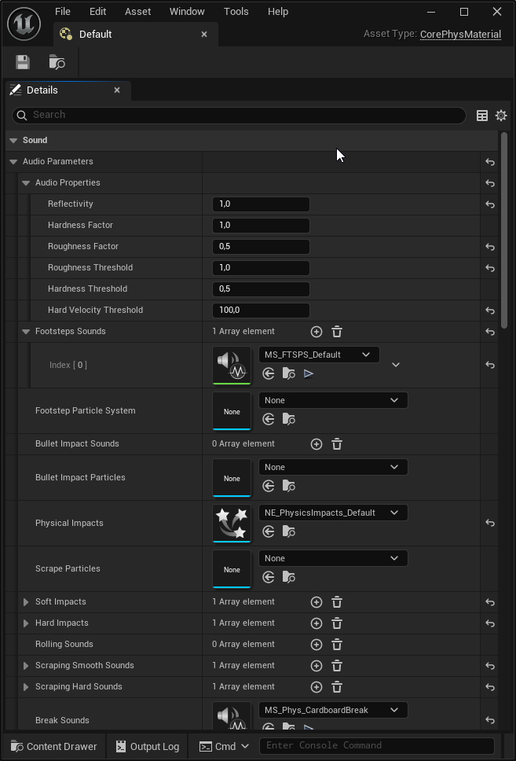

# CorePhysMaterial

**CorePhysMaterial** is a custom physical material type designed specifically for managing advanced audio and visual responses related to physical interactions. It enhances realism by providing detailed control over audio and particle effects for various interactions with surfaces and water. It also handles damaging other players, NPCs, physical objects

 

## Parameters

### Audio Properties
- **Reflectivity**: Controls the volume of reflected sound from the material surface. Higher values increase reflectivity.
- **Hardness Factor**: Determines the perceived hardness of the material, affecting volume, tone, and particle generation.
- **Roughness Factor**: Influences sound roughness, affecting the nature of the audio played during scraping interactions.
- **Roughness Threshold**: Defines when a surface is considered rough, affecting audio feedback.
- **Hardness Threshold**: Threshold above which the surface is considered hard.
- **Hard Velocity Threshold**: Velocity threshold at which impacts are classified as "hard."

### Sounds and Particle Effects
- **Footsteps Sounds**: Array of sounds played when walking on this material.
- **Bullet Impact Sounds**: Sounds played upon bullet collision.
- **Impact Soft Sounds**: Sounds triggered by soft physical impacts.
- **Impact Hard Sounds**: Sounds triggered on hard physical impacts.
- **Rolling Sounds**: Sounds emitted by objects rolling over the material.
- **Scraping Smooth Sounds**: Sounds produced during smooth scraping interactions.
- **Scraping Hard Sounds**: Sounds for harder scraping interactions.
- **Break Sounds**: Sounds played upon breaking the material.
- **Damaging Sounds**: Specific sounds indicating damage to the material.
- **Water Impact Sound**: Sound tailored for impacts with water, influenced by velocity.

### Particle Systems
- **Footstep Particles**: Particles emitted upon footsteps.
- **Bullet Impact Particles**: Visual effects for bullet impacts.
- **Physical Impacts**: General particle effects for physical interactions.
- **Scrape Particles**: Particle effect displayed during scraping.

## Water Impacts
- **Water Impacts**: Particle systems for impacts with water.
- **Impact Bubbles**: Particles triggered once when an object initially enters water.
- **Underwater Bubbles**: Continuous bubble particles shown underwater.

## Impact Damage Table
Defines thresholds and conditions under which an object takes damage based on physical interactions:

- **Linear Damage Thresholds**: Maps linear velocity to damage amount.
- **Minimum Linear Speed**: Minimum linear velocity required to inflict damage.
- **Minimum Angular Speed**: Minimum angular velocity required to apply damage.
- **Minimum Mass**: Minimum mass threshold to start applying damage.

### Small and Large Object Specifics
- **Max Small Object Mass**: Mass threshold distinguishing small objects.
- **Small Object Velocity Threshold**: Velocity threshold at which small objects inflict damage.
- **Min Large Object Mass**: Mass threshold for objects considered large.
- **Large Object Velocity Threshold**: Velocity threshold at which large objects inflict damage.
- **Linear Damage Table**: Defines damage applied based on linear velocity thresholds.
- **Angular Damage Thresholds**: Similar logic as linear damage thresholds, but for angular velocity.

### Usage Notes
Level designers can customize these parameters directly in the editor to achieve realistic and contextually appropriate reactions to physical interactions. Sound arrays and particle systems provide variability and enhance gameplay immersion.

