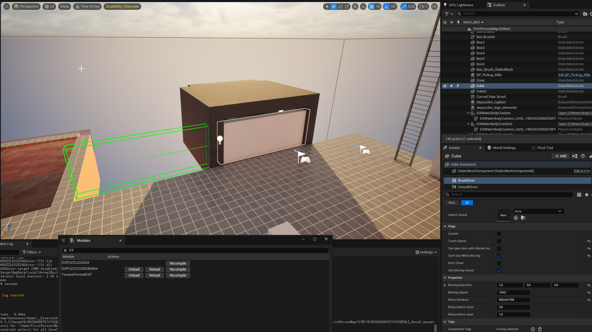

# BrushDoorComponent

The **BrushDoorComponent** is a component for creating interactive, movable doors with open/close functionality, customizable movement properties, and sound cues.

## Component Properties

### Primary Properties

- **bLocked**  
  Controls if the door is locked. When `true`, the door cannot be opened or closed by interactions, and the `OnUseLocked` event is triggered if interaction is attempted.

- **bTouchOpens**  
  Enables the door to open when touched by another actor. If `true`, any actor that collides with the door will initiate an open/close action.

- **bPlayerUseOpens**  
  Allows players to open the door using the interaction key (e.g., "E" key).

- **bCantUseWhileMoving**  
  Prevents further interactions with the door while it is in motion. 

- **bDontClose**  
  When `true`, the door will remain open once fully opened and won’t close automatically.

- **bUseMovingSound**  
  Enables looping sounds while the door is moving.

### Movement-Specific Properties

- **MoveDirection**  
  Defines the direction in which the door moves when opened. This is specified as a vector (e.g., `FVector::UpVector` for upward movement).

- **fMovingSpeed**  
  Sets the speed of door movement.

- **fMoveDistance**  
  Specifies the distance the door will travel from its start position when opened.

- **fDelayBeforeClose**  
  Time in seconds before the door automatically closes after opening, if `bDontClose` is disabled.

- **fDelayBeforeReset**  
  Defines the time (in seconds) required before the door can be interacted with again after it has been locked or recently used.

{}
<strong>Info: </strong>

This entity has editor visualizations, that means when you select door entity you should see green box and line pointing it's open position

{}

### Audio Properties

- **MovingSound**  
  A looping sound that plays while the door is in motion.

- **OpenSound**  
  The sound that plays when the door begins to open.

- **CloseSound**  
  The sound that plays when the door begins to close.

- **FullyOpenSound**  
  The sound that plays when the door reaches its fully open position.

- **FullyCloseSound**  
  The sound that plays when the door is fully closed.

- **UseLockedSound**  
  Sound played when interaction with a locked door is attempted.

- **LockSound**  
  Sound that plays when the door is locked.

- **UnlockSound**  
  Sound that plays when the door is unlocked.

## Events

### Output Events

These events are triggered based on specific door states and interactions, providing ways to link other gameplay elements.

- **OnDoorOpen**  
  Fired when the door starts to open. `Instigator` represents the actor initiating the open action.

- **OnDoorClose**  
  Fired when the door starts to close. `Instigator` is the actor initiating the close action.

- **OnDoorFullyOpened**  
  Fired when the door has reached its fully open position.

- **OnDoorFullyClosed**  
  Fired when the door has fully closed.

- **OnUseLocked**  
  Triggered when an interaction attempt is made on a locked door. `Instigator` is the actor attempting interaction.

- **OnDoorLocked**  
  Fired when the door is locked by an actor. `Instigator` is the actor locking the door.

- **OnDoorUnlocked**  
  Fired when the door is unlocked by an actor. `Instigator` is the actor unlocking the door.

### Input Actions

These actions control the door’s state and behavior.

- **Lock(Instigator)**  
  Locks the door, preventing interactions. Fires the `OnDoorLocked` event and plays `LockSound`. `Instigator` is the actor initiating the lock.

- **Unlock(Instigator)**  
  Unlocks the door, allowing interactions. Fires the `OnDoorUnlocked` event and plays `UnlockSound`. `Instigator` is the actor initiating the unlock.

- **Open(Instigator)**  
  Opens the door, moving it to the open position. Fires `OnDoorOpen` and `OnDoorFullyOpened` events when appropriate. `Instigator` is the actor opening the door.

- **Close(Instigator)**  
  Closes the door, returning it to its start position. Fires `OnDoorClose` and `OnDoorFullyClosed` events when appropriate. `Instigator` is the actor closing the door.

- **Interact(Instigator)**  
  Attempts an interaction with the door. If locked, triggers `OnUseLocked`. If unlocked, the action is determined by the door's current state, triggering open or close events as needed. `Instigator` is the actor attempting interaction.
