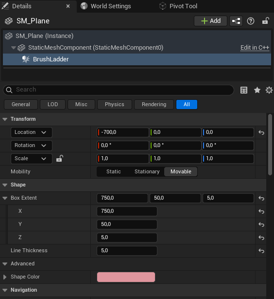
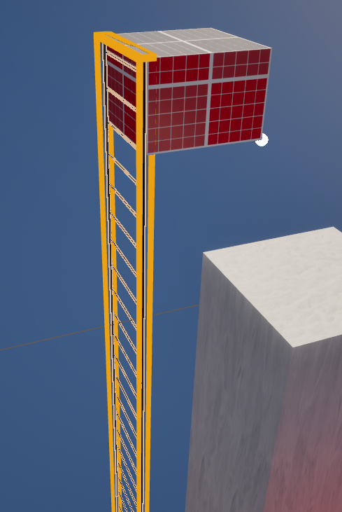

Ladder based on GoldSrc Half-Life game. Size is automatically fit to Static Mesh when component is added. Should be only used with primitive geometry

## Component properties

* Ladder type `ELadderType ENUM` - Determines which footstep sound is playing while moving on ladder

Available:
```
LADDER_DEFAULT = 0
LADDER_WOOD = 1
LADDER_METAL = 2
LADDER_CHAIN = 3
LADDER_GOLDSRC = 4 - makes ladder sound from Half-Life 1
```

## Editor features
* UpdateLadderBounds() - If brush bounds are messed up, you can fix it clicking this button. Should auto-fit to static mesh bounds
<center>



*Brush ladder properties*



*How it looks in editor*
</center>

### Blueprint Functions

* GetLadderType

  **returns:** ``TEnumAsByte<ELadderType>``