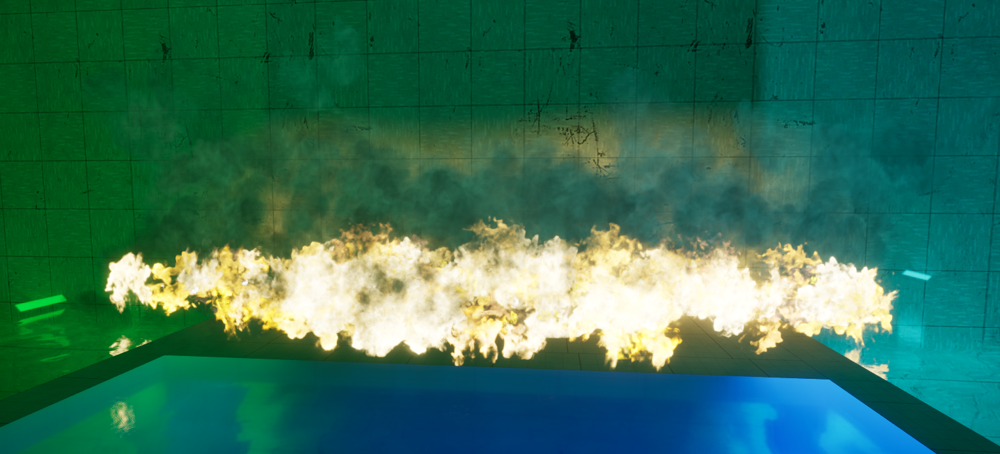

# Fire Actor and FireComponent

The **Fire Actor** and its **FireComponent** allow designers to create and manage fire sources within the game environment. These entities provide extensive control over visual properties, propagation behavior, damage interactions, and lifecycle (ignition/extinguishing) of fires.

## Fire Actor Properties

### General Settings

- **bActive** (bool)
  - Determines whether the fire starts active when spawned.

- **bInfinite** (bool)
  - Specifies if the fire is infinite, i.e., it never extinguishes on its own.

- **IgnitionTime** (float)
  - Duration before the fire automatically extinguishes (ignored if `bInfinite` is true).

- **Damage** (float)
  - Amount of damage the fire inflicts on overlapping actors.

- **DamageInterval** (float)
  - Interval between damage applications to affected actors.

- **bUseCustomVisualSettings** (bool)
  - Enables custom visual settings for fire particles.

- **ParticlesProperties** (FFireComponentVisualProps)
  - Custom visual properties (such as scale, smoke spawn rate, and color).

### Events

- **OnIgnited**  
  Triggered when the fire is ignited by an actor.

- **OnFireExtinguished**  
  Triggered when the fire is extinguished. Provides a reference to the actor that caused the extinguishing event.

## Gameplay Interaction

### Ignition & Extinguishing

- Fire can automatically ignite nearby flammable objects after a delay.
- Automatic extinguishing is controlled by the fire’s `IgnitionTime` or can be set to infinite.
- The extinguishing process generates smoke effects based on object size.

### Damage Application

- Damage is continuously applied to overlapping actors or components.
- Damage calculation is based on proximity, decreasing damage with distance.
- Designers can adjust damage amount and interval.

### Propagation

- Fires can propagate to adjacent flammable objects. [Physical material](../../../PhysMaterial/) must have ``Flamable`` property set-up
- Controlled by `bCanPropagate`.
- Propagation frequency is limited by `IgnitionInterval`.

## Events & Sound Effects

- Automatically handles particle activation/deactivation and associated sound effects on ignition and extinguishing.

## Example Use Cases

- **Environmental hazards**: Set up areas where fire can damage the player or environment objects.
- **Dynamic scenarios**: Utilize custom visuals for thematic environments (e.g., magical fire, chemical fires).
- **Fire propagation** scenarios: Creating chain reactions, such as fire spreading through connected objects.

{}
This entity provides visual and audio feedback directly in the editor, allowing for precise adjustments and easy debugging of gameplay scenarios.
{}

