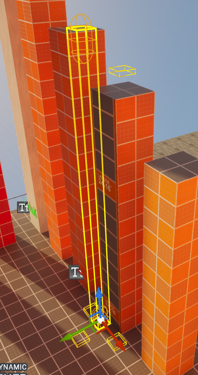
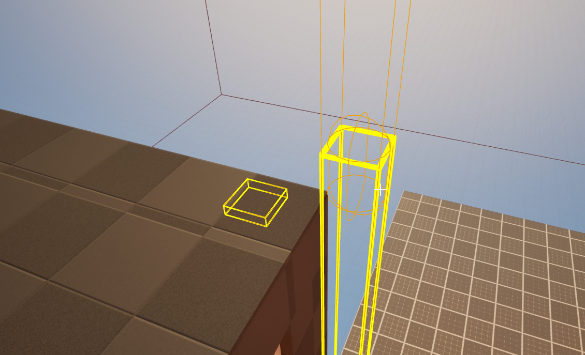

# ASourceLadder Entity Class 

## Overview

Ladder which works like in **Source Engine games** especially in **Half Life 2**. It contains *StartPoint* and *EndPoint*. These are bounds in which player can move up and down and no more. Also can be placed component named **InfoLadderDismount** which indicates a place when player should exit from ladder. Player should automatically detect the right point to escape the ladder

`ASourceLadder` represents a ladder actor within the game world, enabling players to climb or interact with vertical traversal points. This class provides start and end points for the climbable area, as well as event notifications when a player begins using or stops using the ladder.

## Key Features

- Provides a defined vertical area for players to move along (start and end points).
- Supports different ladder types which can determine footstep or interaction sounds.
- Offers event binding through a multicast delegate for usage notifications.
- Integrated with Unreal's networking model, allowing correct synchronization of ladder state on clients and server.

<video autoplay="true" loop="true" width="100%" src="UnrealSourceLadders_VID.mp4" title="Source Ladders"></video>

## Properties

### Ladder Configuration

- **LadderType** 
  Determines the type of the ladder, potentially affecting footstep sounds or other behavior. Defaults to `LADDER_DEFAULT`.

- **bEnabled**
  Indicates whether the ladder is enabled for interaction. If false, players may not be able to climb it. Can be used to disable interactions when for example ladder is destroyed, closed or whatever.

- **StartPoint**
  Capsule component defining the starting position of the ladder climb area.  
  Used to determine the initial climb position for players.

- **EndPoint**
  Capsule component defining the end position of the ladder climb area.  
  Used to determine the top point or ending position of the climb.

- **InfoLadderDismount**
  Point which helps player to escape the ladder to the correct location.

  

{}

Becareful with placing it because wrong placed can cause wrong player behaviour. If there will be a obstacle when escaping ladder to **InfoLadderDismount** player will propably fall.

{}

### Delegates & Events

- **OnUsed** (`Instigator`)  
  Event called whenever player uses the ladder. (Only when entering the ladder, when exiting it is not executed)

## Public Methods

- **Interact(AActor* AInstigator) (override)**  
  Defined by `IInteractionInterface`. Called when a player or another actor interacts with the ladder.  
  Triggers the usage logic, potentially enabling climbing behavior.

- **GetStartPoint()** (`FVector`, BlueprintGetter)  
  Returns the world location of the `StartPoint` component, representing the bottom of the ladder.

- **GetEndPoint()** (`FVector`, BlueprintGetter)  
  Returns the world location of the `EndPoint` component, representing the top of the ladder.

- **GetLadderType()** (`ELadderType`, BlueprintGetter)  
  Returns the currently set `LadderType`.

## Editor-Only Methods (WITH_EDITOR)

- **PostEditMove(bool bFinished)**  
  Called after the ladder actor is moved in the editor.  
  Used internally to update the `HeightBox` so it matches the new ladder placement.

- **PostEditChangeProperty(FPropertyChangedEvent& PropertyChangedEvent)**  
  Called when a property is changed in the editor.  
  Used to maintain consistent ladder geometry and update visual debugging or collision components accordingly.

- **UpdateHeightBox()**  
  Internal utility to recalculate the size and position of `HeightBox` when ladder parameters change.

## Usage Example

1. **Placement:**  
   Drag and drop `ASourceLadder` into the level. Adjust the `StartPoint` and `EndPoint` components to define the climb area.

2. **Configuration:**  
   Set `LadderType` to control the type of footstep sounds when climbing.  
   Make sure `bEnabled` is true to allow interaction.

3. **Interaction:**  
   When a player character interacts with the ladder (e.g., pressing an interaction key), `Interact()` is called, eventually triggering `OnUsedMulticast()` on the server and calling `OnUsed` event.

4. **Event Handling (Blueprint):**  
   Bind to `OnUsed` in a Blueprint to handle custom logic after player enters the ladder.

This class provides a streamlined way to integrate ladder functionality into a game, enabling players to move vertically while providing multiple extension points for customization and event handling.
