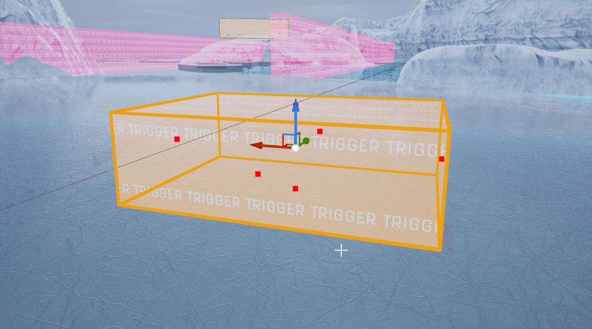

# DXBaseTrigger Entity

The **DXBaseTrigger** is an abstract class serving as a base for all trigger-based entities within DX PUZZLES. It provides general trigger functionalities, allowing interaction with actors based on collision overlaps.

## General Properties

### Trigger Settings

- **Is Enabled**  
  Determines if the trigger is active and can respond to interactions.

- **Trigger Only Once**  
  If enabled, the trigger activates only once and then is destroyed after the specified delay.

- **Next Trigger Delay**  
  Delay before the trigger can activate again after being triggered.

## General Filters

Specifies what type of actors can activate the trigger:

- **Everything**: Allows all types of entities.
- **Players**: Allows only player entities.
- **Physics**: Allows only entities with physics simulation enabled.
- **NPCs**: Allows only NPC actors.

## Events

- **OnStartTouch(OverlappedActor, SweepResult)**  
  Triggered when an entity starts overlapping.

- **OnEndTouch(Instigator)**  
  Triggered when an entity stops overlapping.

- **On Enabled(Instigator)**  
  Triggered when the trigger becomes enabled.

- **On Disabled(Instigator)**  
  Triggered when the trigger becomes disabled.

## Inputs

These actions can be triggered via scripts or blueprints:

- **SetEnabled(Instigator, bEnabled)**  
  Enables or disables the trigger.

- **Toggle(Instigator)**  
  Toggles the enabled state of the trigger.

