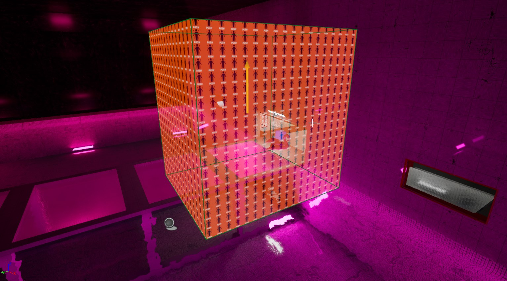

# DXTriggerPush Entity

The **DXTriggerPush** entity applies physical forces to actors that enter its area. It's commonly used to simulate effects such as wind tunnels, conveyor belts, or gravity lifts.

## Properties

### Push Properties

- **Push Direction**  
  Direction in which force is applied to actors within the trigger.

- **Push Force**  
  Magnitude of the force applied.

- **Force Type**  
  Specifies how the force is applied:
  - **Acceleration**: Continuous force, influenced by actor mass.
  - **Velocity Change**: Directly changes actor velocity, ignoring mass.
  - **Impulse**: Applies a single impulse force upon entry.

## Inherited Properties (from DXBaseTrigger)

- **Is Enabled**
- **Trigger Only Once**
- **Next Trigger Delay**

### General Filters

- **Everything**
- **Players**
- **Physics**
- **NPCs**

## Events

- **On Trigger Push Properties Changed**  
  Triggered when the push properties of the entity are updated.

- **OnStartTouch** (Inherited)  
  Triggered when an actor begins overlapping.

- **OnEndTouch** (Inherited)  
  Triggered when an actor ends overlap.

## Inputs (Callable Actions)

- **Set New Push Properties**  
  Updates push force properties dynamically during gameplay. It is recommended to synchronize this on both client and server to avoid desynchronization issues.

## Editor Visualization

In-editor visualization clearly indicates the direction and magnitude of the applied force.