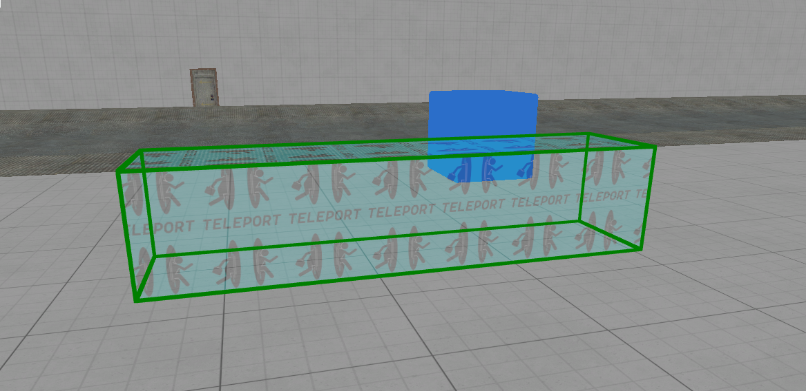

# DXTriggerTeleport Entity

The **DXTriggerTeleport** entity instantly relocates actors upon entry, ideal for puzzles requiring teleportation or movement across game spaces.

## Teleport Properties

- **Teleport Destinations**  
  Specifies target locations to teleport actors. Multiple destinations can be specified, and a random destination will be selected upon each teleportation.

- **Maintain Destination Rotation**  
  If enabled, the teleported actor maintains the rotation specified by the destination point.
  **NOT WORKING**.

- **Teleport Type**  
  Determines the method of teleportation applied (e.g., physics-based teleport).

## Inherited Properties (from DXBaseTrigger)

- **Is Enabled**
- **Trigger Only Once**
- **Next Trigger Delay**

### General Filters

- **Everything**
- **Players**
- **Physics**
- **NPCs**

## Events

- **On Actor Teleported**  
  Triggered whenever an actor is successfully teleported by this trigger.

- **OnStartTouch** (Inherited)  
  Fired when an actor enters the trigger.

- **OnEndTouch** (Inherited)  
  Triggered when an actor exits the trigger.

## Usage Notes

Use this trigger for creating instant relocation mechanics, facilitating puzzle complexity and spatial dynamics within your DX PUZZLES maps.