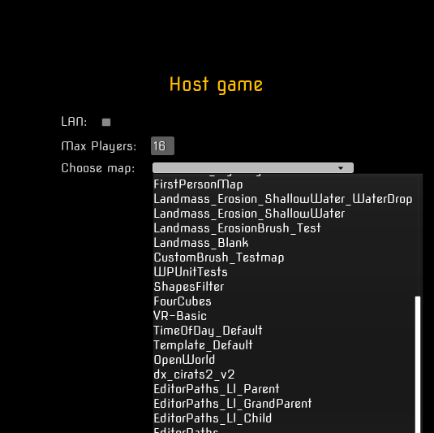

This post will be a little messy because recently I did misc things.

# Main Menu

I've imported Main Menu from my previous project for prototype it is good. This is my only one thing which *is not coded in C++* at the moment. As you can see I was inspired a lot of from Half Life main menu :D There is nothing at the background but this is not important for now.

Important thing is **Steam Sessions** to get it working, hosting a game and joining. I have this menu done working in previous project version, so I do not must code it for now. In addition I added to my **Host Game** window ability to get all available maps in the game and choose which one we want to play.

I have also done **Options** but it requires a lot of polishing, because player is able only to change graphics from profiles from lowest to highest.

<center>


</center>

 In the lowest settings shadows and global illumination looks VERY VERY BAD. I must force that on lowest settings shadows and lighting will be at medium quality level. I do not want to players look at my maps in almost **full-bright mode**

<center>


</center>


 So some advanced configuration would be nice but this is not necessary.

 # DLCs, modding, addons etc...

 If you read the [history and idea of DX PUZZLES]() you know that one of the core feature ones are ability to **make and play** custom maps made by community. So I must have in my game feature similar to DLCs. DLC is a simply an additional content to the game. The same would be in my case. I want community to do the custom maps and have ability to play it.

 > I do not know how to solve the problem of giving community an editor to make custom maps but this is 100% possible. Some games have such a possibility. 
 > * [UE-FN](https://dev.epicgames.com/community/fortnite/getting-started/uefn) - I know this is the product from Epic Games...
 > * [MechWarrior 5 MOD Kit](https://store.epicgames.com/en-US/p/mechwarrior-5--mod-editor) - This is the game not made by Epic Games and it has still custom editor to make mods for this game.
 > * [ARK MOD Kit](https://store.epicgames.com/pl/p/ark--modkit) - This is also pre-compiled editor for community to make mods
 > * [AstroColony](https://buckminsterfullerene02.github.io/dev-guide/CaseStudies/AstroColony.html) - Another game with built Editor for community


<center>


</center>


 I spent whole day to read about making modding support to UE5 game. It should meet some basic requirements like:
 * Custom maps should working independent of base game version (like in Half Life)
 * Easy install and use - something like: *Copy files to this folder and you're done!* (Maybe later some in-game map browsing & downloading?)
 * Additional content should be downloaded from server if client doesn't have it on local machine

The easiest way to do it is just using built-in into engine .pak files loading. Unreal loads .pak files when engine initializes. So I can just override ``GameInstance`` class and write there code which will handle loading these files and showing them into for e.x. in map list

{}

**.PAK files** - It is some kind of archive format like .7z, .zip, .rar, .tar etc. It is used mostly by Unreal Engine and it stores assets from the game like models, textures, maps, sounds. PAK's are compressed files to reduce the assets size, they can be also **ENCRYPTED** so people can't unpack content and reuse it somewhere else (for example when modders want to port our content to other game like people did it in Garry's Mod with Mario and Nintendo went brrr..). These files are created by Epic Games **UnrealPak** command-line application

{}

<center>



</center>

I found a lot of articles about modding in Unreal Engine, even a [UE modding Discord Server](https://discord.gg/x2U3nYug). 

[Example Project: Loading PAK files at runtime](https://dev.epicgames.com/community/learning/tutorials/7Bj8/unreal-engine-example-project-loading-pak-files-at-runtime) - I think this is the one of the best which shows how to do it, it is even code which you can just use and you have a ready system which loads .pak files. This is the loader where you can specify a specific file to load. I tested it out just with built-in feautre:

<center>


</center>

... and it works as intended. So it turns out that the best option for just adding a custom maps is [Chunking](https://dev.epicgames.com/documentation/en-us/unreal-engine/preparing-assets-for-chunking-in-unreal-engine?application_version=5.3). But packaging it is a pure PAIN. Maybe later I will find out a better way how to do it. 

<center>


</center>

Fun fact about .pak loading system is that we can mod our game. You only need to provide an archive with files to override for example player model and it must be loaded AFTER the base game files. You only must provide ``_p`` prefix in the .pak file name.

One of the possibilities for creating "DLCs" was creating plugins to the engine and packaging them. It is described how to do it here:

https://www.tomlooman.com/unreal-engine-mod-support-example/

I tried do it this way but as you can see on the screen above, packaging plugin always failed. I couldn't find the solution how to fix this problem (propably it was caused by version of UE I am using) and I decided to try Chunking which worked.

> For more information about Unreal Engine Modding you can look up here:
> * https://buckminsterfullerene02.github.io/dev-guide/Overview.html
> * https://forums.unrealengine.com/t/in-unreal-5-whats-the-definitive-way-of-supporting-user-generated-content/1529487

# HammUEr - importing maps from Source Engine

As may noticed I also converted my map [dx_cirats2_v2]() onto UE5. 

<center>


</center>

This plugin has a bunch of settings we must tweak before converting. For example the **main setting** is ``Conversion Scale``. This will ensure that our map will be in the correct sizing. 

In Source Engine:

```
1 game unit = 1.905cm
2 game units = ~4cm (NOT 3.81cm as you guessed!)
4 game units = ~7.5cm (NOT 7.62cm)
16 game units = ~30cm (NOT 30.48cm)

etc.
```

So as you can see Source Unit system is inaccurate in conversion to real world units

Unreal Engine metrics are simple: **1 Unreal Unit = 1 cm**

{}
In Unreal Engine real-world measurments may be smaller so you must make an adjustments to fit the proper scale
{}

So I was trying to do an conversion from Source Units to Unreal Engine Units to perfectly fit the scale but I was wrong. In quick math the scale factor should be 52.5. But it is too much. In trial and error method I figured out it should be **37.099998**. How I figured it out? I just made in Source Engine a map with an door entry where player will fit per pixel while standing and I was trying to fit it in Unreal Engine and it gave me this number mentioned ealier.

<center>


</center>

I know it is not perfect scale conversion but it should work for the most cases. [More about Unreal Engine dimensions, scaling and proportions you can see here](https://www.youtube.com/watch?v=Is_68PZ-M5M).

# Ligtmass, Lumen

In Source Engine we had only baked lighting, when I wanted to preview how it looks we must compile the map. I told about it [here](). The pre-baked lighting is **THE MOST** performant option in games. It do not need a high-end graphics card or PC. 

I told that the Lumen in Unreal Engine is sort of amazing thing because it is **WYSIWYG**
{}

**WYSIWYG** - what you see is what you get

{}

So you can place the light, tweak it, change colors, intensity and bunch more other options and you KNOW INSTANTLY how it will look like. 

I don't want my game to look super good as AAA games. I want it to be just pretty/nice but I also want it can be ran by most computers like my laptop with GTX 1050. I checked how performance will change on baked lighting(Lightmass) and Lumen - on my GTX 1050. It was 20 fps difference. This is a lot. I asked if is it bad to make two versions of lighting and community of Unreal Source told me it is **BECAUSE OF** difference between them will be noticable BUT as I said I don't wanna my game look as AAA, graphics here are not most important


<center>

### Do you spot difference?


</center>

It is not a big difference for me. But lumen has a one big issue (in my case).

<center>


 
</center>


It is caused by too big static meshes (for ex wall). Lumen has problem with lightining it up so the solutions are:

1. Do "rats" map only in baked lightning mode (we can still use lumen one's as dynamic/moving lights)
2. "Chop" my static meshes into smaller pieces - I didn't try this solution yet.

It is caused also only when I boost **indirect lighting** above value 0. 

## What does indirect lighting? 


{}

Indirect Lighting in Unreal Engine refers to light that does not come directly from a light source but is instead reflected off various surfaces in the scene. In the light settings, the indirect lighting value affects how this indirect light is calculated and rendered. Here's a more detailed explanation:

### What is Indirect Lighting?
1. **Reflected Light**: Indirect light is the light that has been reflected off surfaces in the scene. For example, sunlight entering a room can bounce off walls, floors, and other objects, illuminating areas that are not directly lit by the sun.

2. **Scene Realism**: Indirect light is crucial for creating realistically looking scenes because, in the real world, most of the light we see is reflected light.

### Indirect Lighting Settings in Unreal Engine:
In Unreal Engine, settings related to indirect lighting can vary depending on the type of light source (e.g., point light, directional light, area light) and the lighting technique used (e.g., Lightmass for static lighting, ray tracing for dynamic lighting).

**Key Indirect Lighting Parameters:**
1. **Indirect Lighting Intensity**:

     * **Description:** This is a multiplier that affects the brightness of the indirect light emitted by a given light source.
    * **Usage:** Increasing the Indirect Lighting Intensity value will make the indirect light brighter, which can be useful to highlight light reflections in dark areas. Decreasing this value will make the indirect light less visible.
2. **Volumetric Scattering Intensity** (for volumetric light sources):

    * **Description:** This affects the amount of indirect light scattered in the atmosphere.
    * **Usage:** Increasing this value makes the light more diffused, which can be useful for achieving effects like fog or smoke.
3. **Lightmass Settings** (for static lighting):

    * **Indirect Lighting Quality:** Sets the quality of indirect light calculations during the light building process (Lightmass).
    * **Indirect Lighting Smoothness:** Affects how smoothly shadows and indirect light transitions, helping to reduce noise and artifacts.
4. **Ray Tracing Settings** (for dynamic lighting):

    * **Max Bounces:** Specifies the maximum number of light bounces, affecting the accuracy and realism of indirect light, but also the rendering performance.
    * **Samples Per Pixel:** The more samples per pixel, the more precise and less noisy the indirect light effects will be.

In summary, indirect lighting in Unreal Engine is responsible for managing reflected light, which is essential for creating realistic and atmospheric scenes in games and 3D applications.

{}

Let me show you just some examples:

<center>


</center>

Stains I am talking about are only appearing when I set indirect on value greater than zero. With baked light in my map is also problem because it looks like this:

<center>


</center>

In baked version it looks UGLY, without any mood, vibe. I assume it is the sort of configuring the Lightmass so it can be fixed. I very like how with so low effort I achieved nice looking map. 

**Unreal Engine does it's job.**