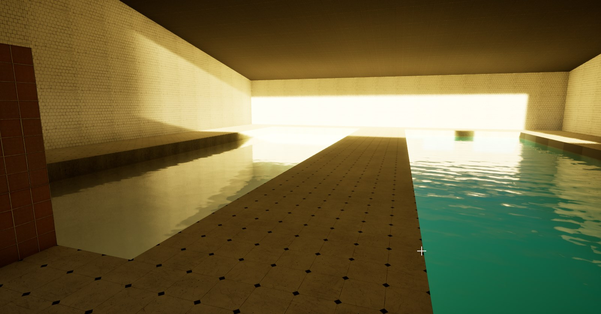
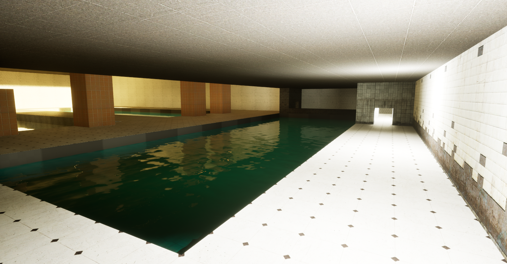
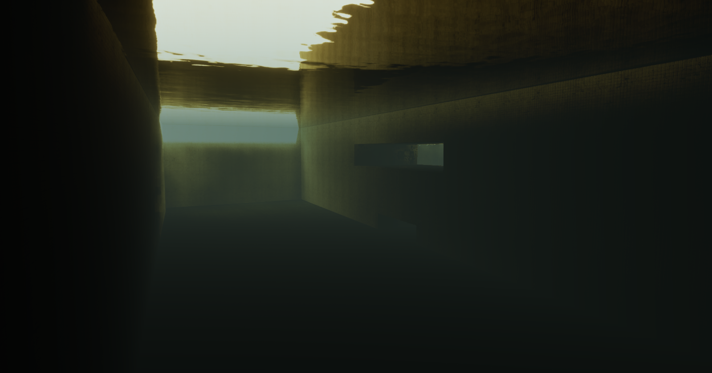
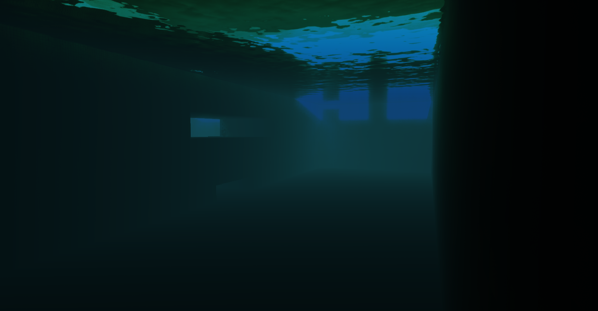

Finally I got working water. In [previous article]() I was saying about that Epic's water plugin isn't working properly especially the *Water Body Custom* one. I made my own water class which derives from that one. Some time ealier I wanted to code it in the way that user can just place water and he will not have to place manually the *Physics Volume* to make water functional. 

Now it is done automatically. You are placing the water, and boom. Done.

<center>

<video controls autoplay="true" loop="true" src="WaterPlacing.mp4" width="100%" title="Placing water"></video>
*Little presentation*

</center>


I done additional things like:

* Lack of need making separate materials for every water placed in the level
* Changing water properties in real time and it is applying into the game without any additional materials
<hr>

<center>

<video controls autoplay="true" loop="true" src="WaterEditing.mp4" width="100%" title="Water Editing"></video>
*Here you can see the possibilities*

</center>

User is able to change water surface color, udnerwater fog color, scattering, fog density and much more. I think I should expand this for many other options. 

## How it works?

This is very simple because it still uses the Epic's water and underwater post process materials. My code only make a separate **Dynamic ones**. On actor placing or initialization editor is making dynamic instance of material and when you are changing properties it applies to that dynamic one. Properties are saved so when game is builed or you want to go into play mode, code is making the same as in the editor. I had to separate the editor things and game things in code with
```#if WITH_EDITOR``` 
tags. I am proud of myself because it is the thing no one had a solution for but I found one and made it even better. 


{}

### DXWaterBodyCustom.cpp

```cpp

// DX STUDIO 2024
#include "Entities/Actors/DXWaterBodyCustom.h"
#include "WaterBodyCustomComponent.h"

#if WITH_EDITOR
#include "Builders/CubeBuilder.h"
#include "Editor.h"
#include "ActorFactories/ActorFactory.h"
#endif


#include "Components/SplineComponent.h"
#include "WaterSplineComponent.h"
#include "Components/BrushComponent.h"


ADXWaterBodyCustom::ADXWaterBodyCustom()
{
#if WITH_EDITOR

	if(WaterBodyComponent)
	{
		CreateEditorDynamicWaterMaterial();		
	}

#endif
}

void ADXWaterBodyCustom::BeginPlay()
{
	Super::BeginPlay();

	CreateMaterialsFromProperties();
}

// This is called when actor is already placed onto the level and level is loaded up.
void ADXWaterBodyCustom::PostLoad()
{
	Super::PostLoad();
}

#if WITH_EDITOR
void ADXWaterBodyCustom::OnConstruction(const FTransform& Transform)
{
	Super::OnConstruction(Transform);

	if (SplineComp)
	{
		USplineComponent* Spline = Cast<USplineComponent>(SplineComp);
		if(Spline)
		{
			Spline->ClearSplinePoints();
		}

	}
	if(WaterPhysicsVolume && WaterPhysicsVolume->BrushBuilder) 
	{
		WaterPhysicsVolume->GetOnVolumeShapeChangedDelegate().Broadcast(*WaterPhysicsVolume);
	}

	if(WaterBodyComponent && WaterBodyComponent->GetWaterMaterial() == nullptr)
	{
		//UE_LOG(LogActor, Error, TEXT("WaterBodyComponent material is nullptr in: %s, trying to bring back the defaults and recreate MIDs"), *GetActorLabel());

		BringDefaultMats();
		CreateEditorDynamicWaterMaterial();
	}
}

void ADXWaterBodyCustom::PostActorCreated()
{
	Super::PostActorCreated();
	if (WaterBodyComponent)
	{
		UMaterialInterface* Mat = Cast<UMaterialInterface>(WaterMaterialPath.TryLoad());
		UMaterialInterface* MatPost = Cast<UMaterialInterface>(UnderwaterPostProcessMaterialPath.TryLoad());
		UStaticMesh* Mesh = Cast<UStaticMesh>(WaterMeshPath.TryLoad());

		WaterBodyComponent->SetWaterAndUnderWaterPostProcessMaterial(Mat, MatPost);
		WaterBodyComponent->SetWaterMeshOverride(Mesh);

		CreateEditorDynamicWaterMaterial();
		CreateWaterVolume();
	}
}

void ADXWaterBodyCustom::Destroyed()
{
	Super::Destroyed();

	if (WaterPhysicsVolume)
	{
		WaterPhysicsVolume->Destroy();
		WaterPhysicsVolume = nullptr;
	}
}


#endif

void ADXWaterBodyCustom::CreateMaterialsFromProperties()
{
	if (!WaterBodyComponent)
	{
		UE_LOG(LogTemp, Error, TEXT("WaterBodyComponent is nullptr"))
			return;
	}
#if WITH_EDITOR
	if (WaterBodyComponent->GetWaterMaterial() == nullptr || WaterBodyComponent->GetUnderwaterPostProcessMaterialInstance() == nullptr)
	{
		UE_LOG(LogActor, Error, TEXT("WaterMaterial or UnderwaterPostProcessMaterialInstance is nullptr in: %s, trying to bring back the defaults and recreate MIDs"), *GetActorLabel());
	}
#endif

	BringDefaultMats();

	WaterSurfaceMID = UMaterialInstanceDynamic::Create(WaterBodyComponent->GetWaterMaterial(), this, FName("WaterSurfaceMID_CPP"));
	WaterSurfaceMID->SetFlags(RF_Transient);
	//WaterSurfaceMID->Parent = Cast<UMaterialInterface>(WaterParent.TryLoad());

	if(!WaterSurfaceMID->Parent)
		UE_LOG(LogActor, Error, TEXT("Failed to load WaterParent material"))

	WaterSurfaceMID->SetVectorParameterValue("Absorption", WaterAbsorptionColor);
	WaterSurfaceMID->SetVectorParameterValue("Scattering", WaterScatteringColor);
	WaterSurfaceMID->SetScalarParameterValue("Refraction", Refraction);
	WaterSurfaceMID->SetScalarParameterValue("Roughness", WaterRoughness);
	WaterSurfaceMID->SetScalarParameterValue("Specular", WaterSpecular);
	WaterSurfaceMID->SetScalarParameterValue("Default Near Normal Strength", WaterNormalStrenght_Near);

	WaterBodyComponent->SetWaterMaterial(WaterSurfaceMID);

	UMaterialInterface* MatPost = Cast<UMaterialInterface>(UnderwaterPostProcessMaterialPath.TryLoad());
	UnderwaterPostProcessMID = UMaterialInstanceDynamic::Create(MatPost, this, FName("UnderwaterPostProcessMID_CPP"));
	UnderwaterPostProcessMID->SetFlags(RF_Transient);
	UnderwaterPostProcessMID->SetScalarParameterValue("WaterZLine", GetActorLocation().Z);
	UnderwaterPostProcessMID->SetScalarParameterValue("Fog", WaterFogDensity);
	UnderwaterPostProcessMID->SetVectorParameterValue("Fog Ambient Color", UnderwaterFogAmbient);
	UnderwaterPostProcessMID->SetVectorParameterValue("Fog Scatter Color", UnderwaterFogScatter);
	UnderwaterPostProcessMID->SetVectorParameterValue("Absorption", Absorption);

	WaterBodyComponent->SetUnderwaterPostProcessMaterial(UnderwaterPostProcessMID);
}

void ADXWaterBodyCustom::BringDefaultMats()
{

	UMaterialInterface* Mat = Cast<UMaterialInterface>(WaterMaterialPath.TryLoad());
	UMaterialInterface* MatPost = Cast<UMaterialInterface>(UnderwaterPostProcessMaterialPath.TryLoad());

	if (WaterBodyComponent->GetWaterMaterial() == nullptr)
	{
		WaterBodyComponent->SetWaterMaterial(Mat);
#if WITH_EDITOR
		UE_LOG(LogActor, Log, TEXT("%s's Water material set to default: %s"), *GetActorLabel(), *WaterBodyComponent->GetWaterMaterial()->GetFullName());
#endif
	}

	if (WaterBodyComponent->GetWaterMaterial() != nullptr && WaterBodyComponent->GetWaterMaterial()->GetFullName() != WaterMaterialPath.ToString())
	{
		WaterBodyComponent->SetWaterMaterial(Mat);
#if WITH_EDITOR
		UE_LOG(LogActor, Log, TEXT("%s's Water material set to default: %s"), *GetActorLabel(), *WaterBodyComponent->GetWaterMaterial()->GetFullName());
#endif
	}

}


#if WITH_EDITOR
void ADXWaterBodyCustom::CreateEditorDynamicWaterMaterial()
{
	WaterSurfaceMID_Editor = UMaterialInstanceDynamic::Create(WaterBodyComponent->GetWaterMaterial(), this, FName("WaterEditorMIDTest"));
	UE_LOG(LogActor, Log, TEXT("WaterSurfaceMID_Editor created: %s"), *WaterSurfaceMID_Editor->GetFullName());


	UMaterialInterface* UnderMat = Cast<UMaterialInterface>(UnderwaterPostProcessMaterialPath.TryLoad());
	UnderWaterPostProcessMID_Editor = UMaterialInstanceDynamic::Create(UnderMat, this, FName("UnderwaterEditorMIDTest"));
	UE_LOG(LogActor, Log, TEXT("UnderWaterPostProcessMID_Editor created: %s"), *UnderWaterPostProcessMID_Editor->GetFullName());

	if (WaterSurfaceMID_Editor)
	{
		WaterSurfaceMID_Editor->SetFlags(RF_Transient);
		WaterSurfaceMID_Editor->SetVectorParameterValue("Absorption", WaterAbsorptionColor);
		WaterSurfaceMID_Editor->SetVectorParameterValue("Scattering", WaterScatteringColor);
		WaterSurfaceMID_Editor->SetScalarParameterValue("Refraction", Refraction);
		WaterSurfaceMID_Editor->SetScalarParameterValue("Roughness", WaterRoughness);
		WaterSurfaceMID_Editor->SetScalarParameterValue("Specular", WaterSpecular);
		WaterSurfaceMID_Editor->SetScalarParameterValue("Default Near Normal Strength", WaterNormalStrenght_Near);


		WaterBodyComponent->SetWaterMaterial(WaterSurfaceMID_Editor);
	}
	else
		UE_LOG(LogActor, Error, TEXT("%s: Failed to create WaterSurfaceMID_Editor"), *GetActorLabel());

	if (UnderWaterPostProcessMID_Editor)
	{
		UnderWaterPostProcessMID_Editor->SetFlags(RF_Transient);
		UnderWaterPostProcessMID_Editor->SetScalarParameterValue("WaterZLine", GetActorLocation().Z);
		UnderWaterPostProcessMID_Editor->SetScalarParameterValue("Fog", WaterFogDensity);
		UnderWaterPostProcessMID_Editor->SetVectorParameterValue("Fog Ambient Color", UnderwaterFogAmbient);
		UnderWaterPostProcessMID_Editor->SetVectorParameterValue("Fog Scatter Color", UnderwaterFogScatter);
		UnderWaterPostProcessMID_Editor->SetVectorParameterValue("Absorption", Absorption);

		WaterBodyComponent->SetUnderwaterPostProcessMaterial(UnderWaterPostProcessMID_Editor);
	}
	else
		UE_LOG(LogActor, Error, TEXT("%s: Failed to create UnderWaterPostProcessMID_Editor"), *GetActorLabel());

}

void ADXWaterBodyCustom::CreateWaterVolume()
{
	FActorSpawnParameters PhysicsVolumeSpawnParams;

	if (!WaterPhysicsVolume)
	{/*
		WaterPhysicsVolume = GetWorld()->SpawnActor<APhysicsVolume>(GetActorLocation(), FRotator::ZeroRotator, PhysicsVolumeSpawnParams);
		WaterPhysicsVolume->SetActorLabel(FString::Printf(TEXT("%s_PhysicsVolume"), *GetName()));

		ABrush* NewBrush = GetWorld()->SpawnBrush();
		NewBrush->BrushType = Brush_Default;
		NewBrush->BrushBuilder = NewObject<UCubeBuilder>(NewBrush, UCubeBuilder::StaticClass());
		UCubeBuilder* Builder = Cast<UCubeBuilder>(NewBrush->BrushBuilder);

		Builder->X = 128.0f;
		Builder->Y = 128.0f;
		Builder->Z = 128.0f;

		WaterPhysicsVolume->BrushBuilder = Builder;
		Builder->Build(GetWorld(), WaterPhysicsVolume);

		WaterPhysicsVolume->Brush = NewObject<UModel>(WaterPhysicsVolume, UModel::StaticClass());
		WaterPhysicsVolume->GetBrushComponent()->BuildSimpleBrushCollision();
		WaterPhysicsVolume->ReregisterAllComponents();

		UE_LOG(LogTemp, Warning, TEXT("WaterPhysicsVolume created, verts: %i"), WaterPhysicsVolume->Brush->NumUniqueVertices);*/

		UObject* PhysVolumeObj = FindObject<UObject>(nullptr, TEXT("/Script/Engine.PhysicsVolume"));
		UActorFactory* PhysVolumeFactory = GEditor->FindActorFactoryForActorClass(APhysicsVolume::StaticClass());
		FTransform Transform = GetActorTransform();

		WaterPhysicsVolume = Cast<APhysicsVolume>(PhysVolumeFactory->CreateActor(PhysVolumeObj, GetWorld()->PersistentLevel, Transform));
		WaterPhysicsVolume->bWaterVolume = true;
		WaterPhysicsVolume->SetActorLabel(FString::Printf(TEXT("%s_PhysicsVolume"), *GetName()));
		WaterPhysicsVolume->AttachToActor(this, FAttachmentTransformRules::KeepWorldTransform);

		UCubeBuilder* Builder = Cast<UCubeBuilder>(WaterPhysicsVolume->BrushBuilder);
		Builder->X = 256;
		Builder->Y = 256;
		Builder->Z = 256; // Change to water depth
		

		WaterPhysicsVolume->BrushBuilder = Builder;
		Builder->Build(WaterPhysicsVolume->GetWorld(), WaterPhysicsVolume);

		WaterPhysicsVolume->GetBrushComponent()->RequestUpdateBrushCollision();

		
		WaterPhysicsVolume->SetActorLocation(GetActorLocation() - FVector(0,0,128));
		WaterPhysicsVolume->GetOnVolumeShapeChangedDelegate().Broadcast(*WaterPhysicsVolume);
		
	}
}


void ADXWaterBodyCustom::PostEditChangeProperty(FPropertyChangedEvent& PropertyChangedEvent)
{
	Super::PostEditChangeProperty(PropertyChangedEvent);

	if(WaterPhysicsVolume)
		WaterPhysicsVolume->GetOnVolumeShapeChangedDelegate().Broadcast(*WaterPhysicsVolume);

	if(PropertyChangedEvent.GetPropertyName() == GET_MEMBER_NAME_CHECKED(ADXWaterBodyCustom, WaterAbsorptionColor) || PropertyChangedEvent.GetPropertyName() == GET_MEMBER_NAME_CHECKED(ADXWaterBodyCustom, WaterScatteringColor))
	{
			if (WaterSurfaceMID_Editor)
			{
				WaterSurfaceMID_Editor->SetVectorParameterValue("Absorption", WaterAbsorptionColor);
				WaterSurfaceMID_Editor->SetVectorParameterValue("Scattering", WaterScatteringColor);
				WaterSurfaceMID_Editor->SetScalarParameterValue("Refraction", Refraction);
				WaterSurfaceMID_Editor->SetScalarParameterValue("Roughness", WaterRoughness);
				WaterSurfaceMID_Editor->SetScalarParameterValue("Specular", WaterSpecular);
				WaterSurfaceMID_Editor->SetScalarParameterValue("Default Near Normal Strength", WaterNormalStrenght_Near);

				if (WaterBodyComponent)
				{
					WaterBodyComponent->SetWaterMaterial(WaterSurfaceMID_Editor);
				}
			}
	}
	if (PropertyChangedEvent.GetPropertyName() == GET_MEMBER_NAME_CHECKED(ADXWaterBodyCustom, Refraction))
	{
		if (WaterSurfaceMID_Editor)
		{
			WaterSurfaceMID_Editor->SetScalarParameterValue("Refraction", Refraction);

				if (WaterBodyComponent)
				{
					WaterBodyComponent->SetWaterMaterial(WaterSurfaceMID_Editor);
				}
		}
	}
	if (PropertyChangedEvent.GetPropertyName() == GET_MEMBER_NAME_CHECKED(ADXWaterBodyCustom, WaterRoughness))
	{
				if (WaterSurfaceMID_Editor)
				{
								WaterSurfaceMID_Editor->SetScalarParameterValue("Roughness", WaterRoughness);

			if (WaterBodyComponent)
			{
								WaterBodyComponent->SetWaterMaterial(WaterSurfaceMID_Editor);
			}
		}
	}
	if (PropertyChangedEvent.GetPropertyName() == GET_MEMBER_NAME_CHECKED(ADXWaterBodyCustom, WaterSpecular))
	{
				if (WaterSurfaceMID_Editor)
				{
								WaterSurfaceMID_Editor->SetScalarParameterValue("Specular", WaterSpecular);

			if (WaterBodyComponent)
			{
								WaterBodyComponent->SetWaterMaterial(WaterSurfaceMID_Editor);
			}
		}
	}
	if (PropertyChangedEvent.GetPropertyName() == GET_MEMBER_NAME_CHECKED(ADXWaterBodyCustom, WaterNormalStrenght_Near))
	{
				if (WaterSurfaceMID_Editor)
				{
								WaterSurfaceMID_Editor->SetScalarParameterValue("Default Near Normal Strength", WaterNormalStrenght_Near);

			if (WaterBodyComponent)
			{
								WaterBodyComponent->SetWaterMaterial(WaterSurfaceMID_Editor);
			}
		}
	}


	// Underwater
	if (UnderWaterPostProcessMID_Editor)
	{
		if (PropertyChangedEvent.GetPropertyName() == GET_MEMBER_NAME_CHECKED(ADXWaterBodyCustom, WaterFogDensity) || PropertyChangedEvent.GetPropertyName() == GET_MEMBER_NAME_CHECKED(ADXWaterBodyCustom, UnderwaterFogAmbient) || PropertyChangedEvent.GetPropertyName() == GET_MEMBER_NAME_CHECKED(ADXWaterBodyCustom, UnderwaterFogScatter) || PropertyChangedEvent.GetPropertyName() == GET_MEMBER_NAME_CHECKED(ADXWaterBodyCustom, Absorption))
		{
			UnderWaterPostProcessMID_Editor->SetScalarParameterValue("WaterZLine", GetActorLocation().Z);
			UnderWaterPostProcessMID_Editor->SetScalarParameterValue("Fog", WaterFogDensity);
			UnderWaterPostProcessMID_Editor->SetVectorParameterValue("Fog Ambient Color", UnderwaterFogAmbient);
			UnderWaterPostProcessMID_Editor->SetVectorParameterValue("Fog Scatter Color", UnderwaterFogScatter);
			UnderWaterPostProcessMID_Editor->SetVectorParameterValue("Absorption", Absorption);

			if (WaterBodyComponent)
			{
				WaterBodyComponent->SetUnderwaterPostProcessMaterial(UnderWaterPostProcessMID_Editor);
			}
		}


	}

}
#endif // WITH_EDITOR

```

{}


I learned a lot of things, espacially about functions which are executed in the editor. I learned about material dynamic instances and many more. That's it.

<center>









</center>