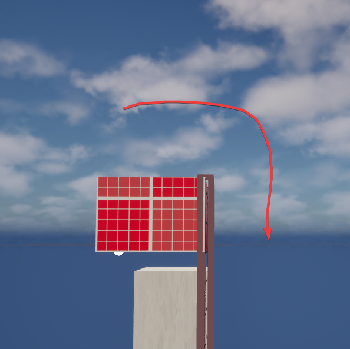
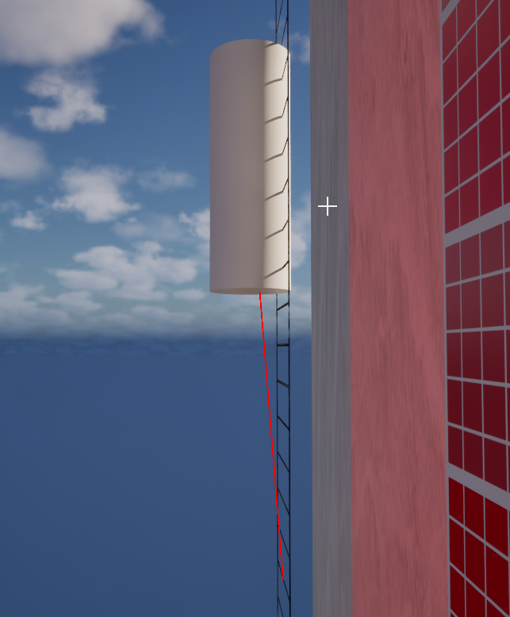
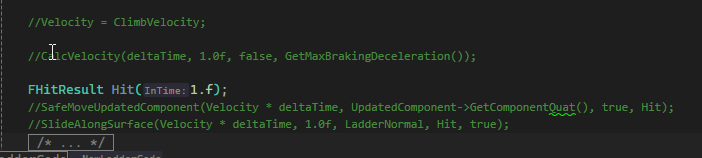

## Engine update - Unreal Engine 5.5 Preview

After long break I returned to the project. But meanwhile new version of engine was released so I had to update my project to this version because I want to have the newer one. Why? Because. There was some problems with plugins but I finally managed to fix it. 

{}

<strong>Intel 13/14th gen stability problems</strong>

<p>Meanwhile when I have put this project aside I wanted to finish Cyberpunk 2077. But couldn't. Why? Because game was crashing every 5 - 10 minutes. It has come to this point that I couldn't finish some mission. I started searching what could it causing this behaviour. I reinstalled every driver, did memtests, did the graphic cards clean install - nothing helped. I found an TikTok which said that Intel CPUs 13/14 gen has manufactur defect and it causes instability in the most games/programs. Instability was felt even in Unreal Engine 5. Yes - I thought it was specific to this engine. No. After updating BIOS and applying Intel's fix it started working normally. Nothing is crashing, but I have still damaged CPU and I need to return it for warranty. So if you have 13/14th gen Intel CPU and have problem with engine stability - check if you need to update your BIOS.
{}

## GoldSrc Ladders

<center>

<video controls autoplay="true" loop="true" width="100%" src="UnrealEditor_yEbk3S3lSC.mp4" title="Ladders in action"></video>

*Almost finished*

</center>

6 months ago I started "porting" ladder system from GoldSrc (Half-Life 1) to my game. It is almost finished, I had problem with climbing down the ladder when the player is going like this:

<center>


</center>

It was hard to calculate the velocity direction which player has to follow. I was looking a lot of time for a solution but it was waiting in the Half-Life source code. The trick is to do a **Line Trace** to the "center of ladder" from player position and check for intersecting [normal](https://en.wikipedia.org/wiki/Normal_(geometry)) of ladder brush. 

<center>



*You can see that LineTrace is hitting the normal of front face of ladder so we can get the normal and set the player movement to move along this surface - that's it*

</center>

Now I have another problem, when my character is going up, or down it also moves slightly forward or backward so it causes that player falls from the ladder. I must find out why is this happening. You can see issue here:

<video controls autoplay="true" loop="true" width="100%" src="laddermovement_off.mp4" title="Ladder movement is off"></video>


<center>



*I commented out code I suppose issuing it, and my character stopped moving in all directions so yeah - some of these must be causing it*

</center>

Ok and I found this **CalcVelocity** function was causing this. But if I remove it - networking will still work?

Yes it works. That was simple.

### What next?

* ~~When adding a ``BrushLadder`` it is not correctly sizing the ``UBoxComponent`` to fit the ladder Static Mesh~~ - I checked it and it is working, lol
* Jumping off the ladder
* Toggling off/on?
* **Source Ladders Version** (with predefined path to climb)

### Jumping off

Let's do the jumping off the ladder, it should be simple as.. you know what.

**Firstly** I must update my function ``DoJump`` because current overload will be not supported any more so I must change the syntax from:

```cpp
virtual bool DoJump(bool bReplayingMoves) override;
```
to:
```cpp
virtual bool DoJump(bool bReplayingMoves, float DeltaTime) override;
```

After little changes ``DoJump`` functions looks like this:

```cpp

bool UDXMovementComponent::DoJump(bool bReplayingMoves, float DeltaTime)
{
//	if (!bReplayingMoves)
//		pPlayer->JumpTriggered();

	if(CurrentLadder)
	{
		constexpr float fJumpOffStrength = 400.0f;

		// We need to jump off the ladder in the opposite direction of the ladder normal
		Launch(FVector(LadderNormal.X * fJumpOffStrength, LadderNormal.Y * fJumpOffStrength, 0));
		return true;
	}

	SetDefaultMovementMode();
	if(IsActuallySprinting())
	{
		Stamina = FMath::Clamp(Stamina - GameState->PlayerJumpStaminaDrainAmount, 0.0f, GameState->PlayerMaxStamina);
		StaminaLastUsedTime = GameState->GetServerWorldTimeSeconds();
		bStaminaCanRegenerate = false;
	}

	return Super::DoJump(bReplayingMoves, DeltaTime);
}

```

It has implemented jumping off from the ladder and it feels like GoldSrc now.

<center>

<video controls autoplay="true" loop="true" width="100%" src="UnrealEditor_PTiSVKPVAE.mp4" title="Jumping off from the ladder"></video>

</center>

I am happy I got this finally working. Still needs some tweaking but the main goal has been reached.

<center>

<video controls autoplay="true" loop="true" width="100%" src="UnrealEditor_xsmPaEXpVV.mp4" title="Final ladder result"></video>