# Progress

I made a lot of progress. **A LOT**. Firstly I want to show another map I started to make to have something playable in this project. I figured out in 90% how to handle DLCs/Custom maps in my DX PUZZLES but I will talk about it later. I want to make this post short as possible because of a lot of content to show.

## Main menu update - map choosing

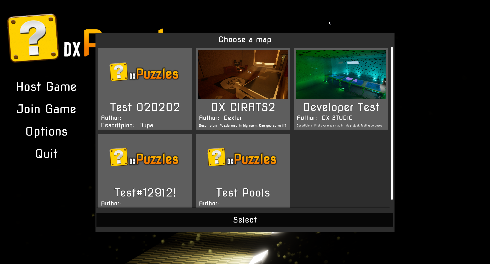

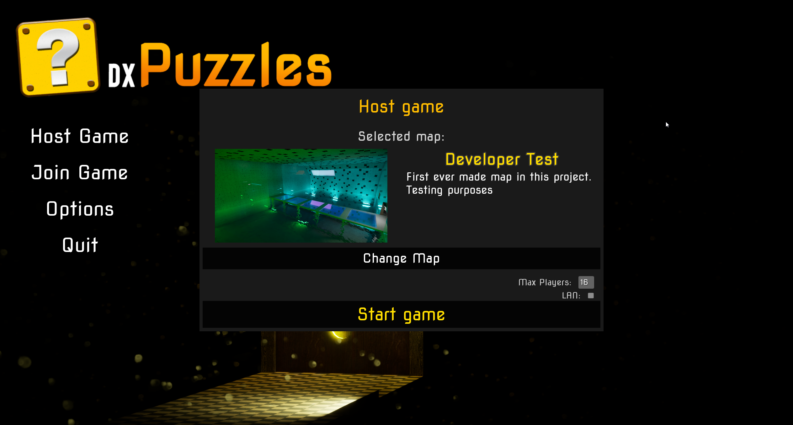

I rebuilded UI for map choosing, I think this is much better but it still needs a lot of polishing. 

## DLCs

I have noticed that I can make custom maps/DLC support with Unreal Engine's chunking system. You can just mark folder or files to be specific chunk and this chunk is separate .pak file which can be removed/moved etc. 

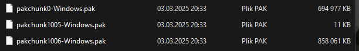

I can't figure out one thing. I wanted to organise my file structure to keep things tidy, so I am using UGC plugin to create separate "plugin" to have specific folder for additional conent (DLC/custom map).

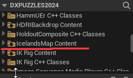

The problem is with recognizing files by Unreal with this file structure. If I would move it to the "/Game/" folder the problem will disappear, but I want in this folder keep only main necessary game content. I think I will find out how to handle this properly.

## Water Buoyancy, Physics Objects, collisions etc.

I added support for collision handling, water buoyancy (Water Physics plugin) with my own [Base Physics Entity](../../docs/entites/Point%20Actors/BasePhysicsEntity/). It is based on own [Physical Material class](../../docs/PhysMaterial/) which contains all the information about behaviour of physics objects. It has damage table (how specific phys material should damage other objects), impact sounds, impact particles and many more. 

**Fun fact:** I tried to code my own buoyancy system, I thought I wasted my time for it but.. no. I learned a lot about game mathematics. I was close to the correct behaviour but it turned out I had **async sub-stepping physics** enabled and it was behaving wrongly. So I don't know if my code was correct, I assume it was. I surrended and integrated the water physics which is free plugin into my project.

You can see my attempts to make buoyancy here:

<video muted autoplay loop src="UnrealEditor_BMOCnTaPJJ.mp4" title="Attempt 01" width="100%"></video>

<video muted autoplay loop src="UnrealEditor_FFxnz4syuw.mp4" title="Attempt 02" width="100%"></video>

<video controls width="100%" src="UnrealEditor_rXBpZDV82U.mp4" title="Physical Impacts"></video>
*Here you can see physical impacts in action*

{}
<strong>Note:</strong> Video contains loud sound.
{}

## Breakable props

<video muted autoplay loop src="NVIDIA_Overlay_EIEXADgEFU.mp4" title="Breakable prop comparison" width="100%"></video>

I made also breakable physical props based on **Chaos Destruction** system. It is bugged as hell. What you can se on the video is that: 

* Left one is custom class derived from **Geometry Collection Actor**
* Middle one is just **Geometry Collection Actor**
* Right one is same as left one.

See difference in fracturing? It's huge. Why is it happening? I don't know, but you can make just custom class deriving from GC Actor and it breaks.

## AccuRIG

<video muted autoplay loop src="UnrealEditor_pRabnTOQjs.mp4" title="Lara croft" width="100%"></video>

At some day I tried to port oldschool Tomb Raider Lara Croft model to Unreal Engine. It was more simple than I thought. With **AccuRIG** you can easliy rig you character model. Then just retarget animations and viola!

## Scythe plugin

**Kronok** which is the author of this amazing plugin allowed to access early version for patreons. Of course I am gonna support this project. But what is it? The most simply question is: **It is gonna be Source 2 Hammer editor available in the Unreal Engine**. It allows developers like me make levels directly into UE editor. The most important: **We can texture meshes with it and manipulate them**. 

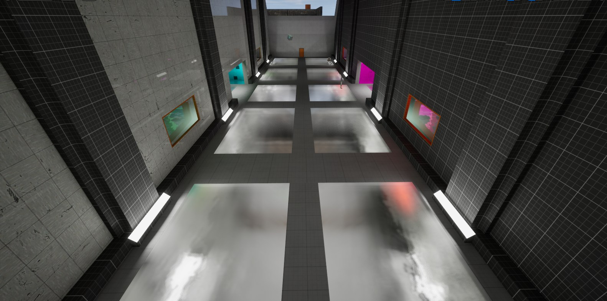
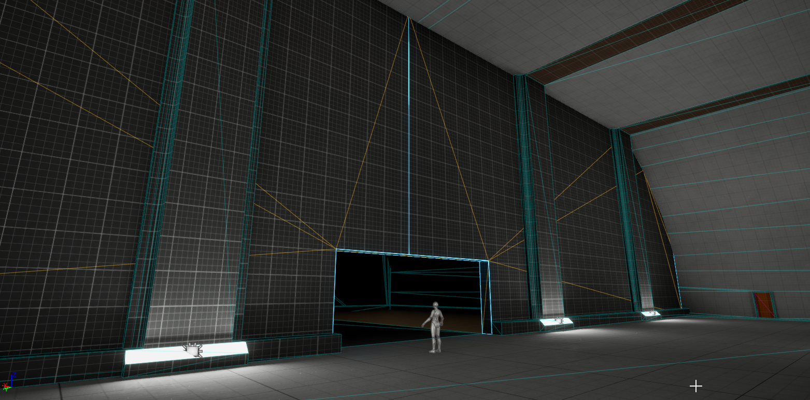
*This is the first thing I created with Scythe Editor*

## Breakable Actor

<video controls src="UnrealEditor_ts8hzPPvtF.mp4" title="Breakable showcase" width="100%"></video>

{}
<strong>Note:</strong> Video contains loud sound.
{}

Here you can see some simple breakable actor which is taking damage from physics objects. You can see mentioned ealier physical material assigned particles, sounds, gibs etc.

You can also damage players with it:

<video muted autoplay loop width="100%" src="UnrealEditor_QOVZZJTvdx.mp4" title="Damaging players with physical props"></video>

## Fire

Just fire. Customizable with propagation.

<video muted autoplay loop src="UnrealEditor_qjHvDH1tsn.mp4" title="Fire showcase 01" width="100%"></video>

<video muted autoplay loop width="100%" src="UnrealEditor_4FSlXmaObd.mp4" title="Fire propagation"></video>

With fire propagation there is certain problem. It is based on physical material properties. It needs to have ``Flamable`` property checked and it can be burned. 

<video muted autoplay loop width="100%" src="UnrealEditor_3ukeDstIuG.mp4" title="Fire propagation problem"></video>

As you can see fire particless are automatically adjusted to the size of entity.

## Momentary buttons & doors - Half Life like

<video muted autoplay loop width="100%" src="explorer_NZUXQ5TwUC.mp4" title="Momentary button & door"></video>

These buttons requires player to hold the interaction button to progress of opening the doors be made. I must also implement that player need to look at the button to make the progress. But it will not be a mandatory thing, it will be configurable in entity properties.

## I finally understood unreal's netowrking?

Maybe.

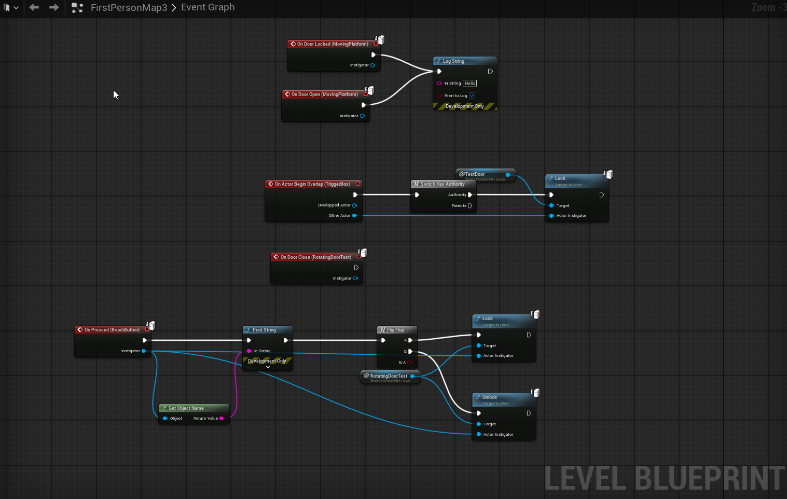
*Simplycity of making interactive map/level*
This is what I wanted the level scripting to look like. I swapped components I have made for actors. It is more simple and less complicated. You are just selecting object in the level ex. door, open level blueprint, RMB -> OnOpen or something other and just code your action you need in your level. That's it.

I finally understood that everything functional should be executed only on server and there is no need for that client have these things executed on theirs PC. This does not mean I understand everything in networking, but... there is a some progress, I think - big progress.

## Icelands

So after that I found out how to make additional content for my game I started making some separate level called **Icelands**. I wanted to make similar map to Half-Life/HL2/Garry's Mod as puzzle map. I don't have any screenshots of it, the only thing I could rely on was a picture from memory. I think it came out pretty well.

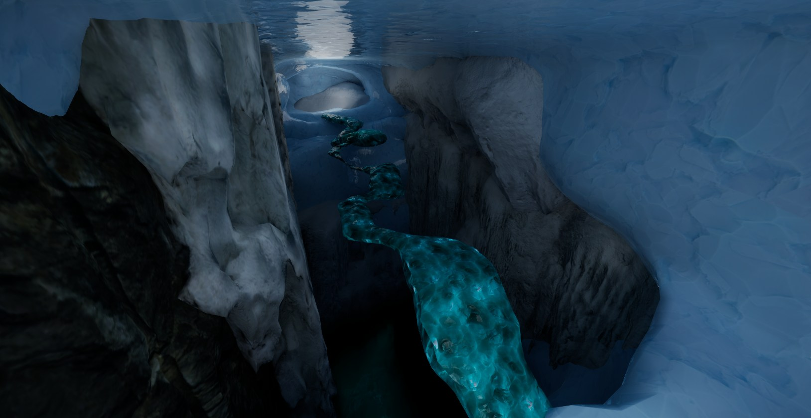

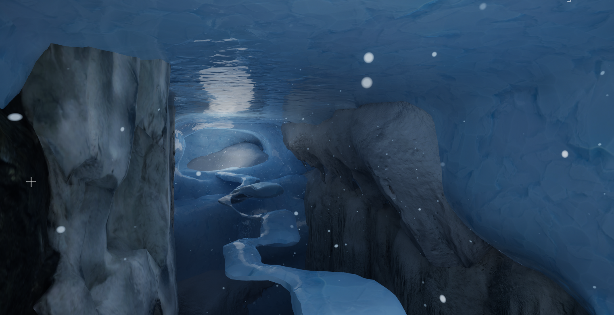

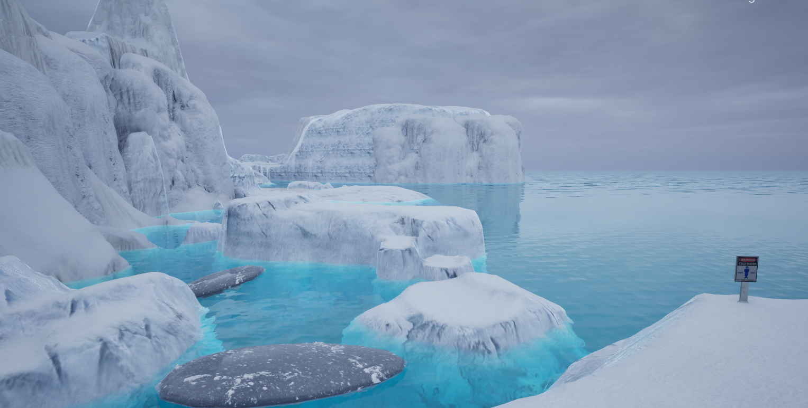

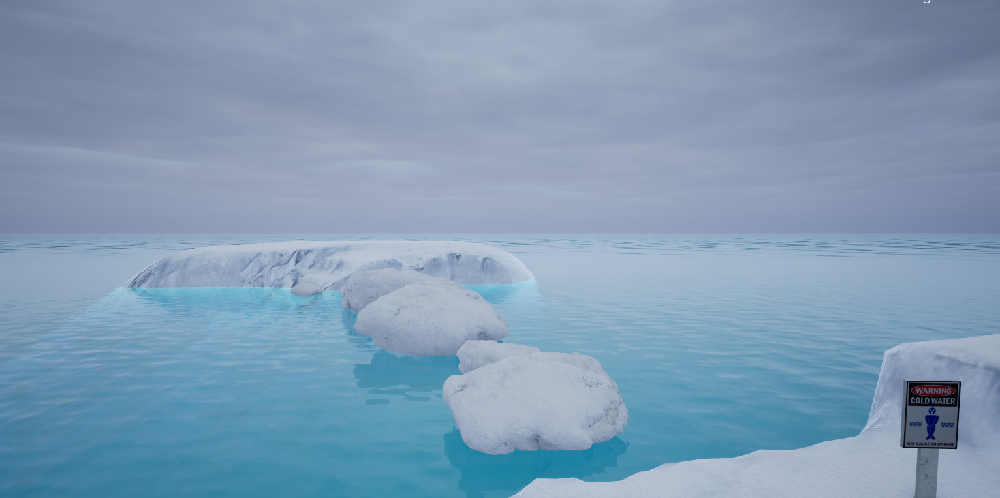

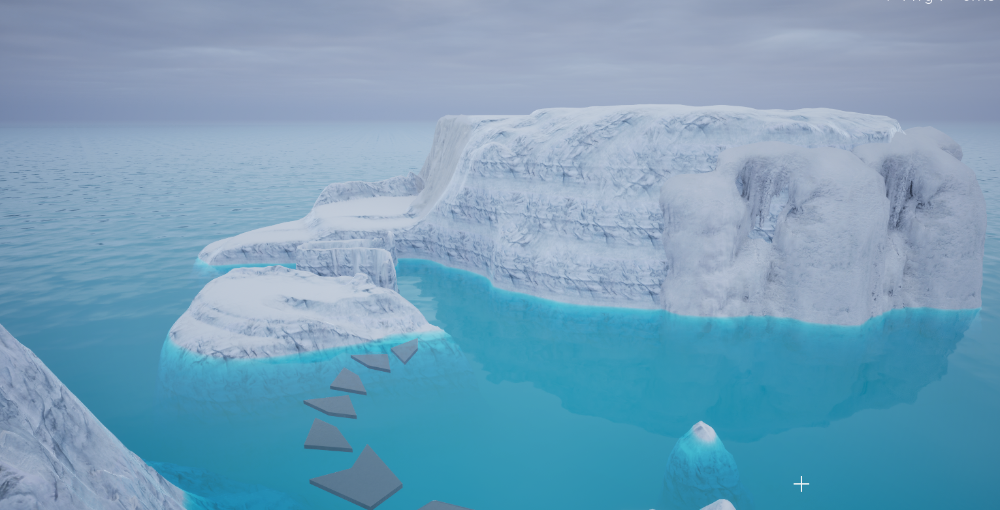

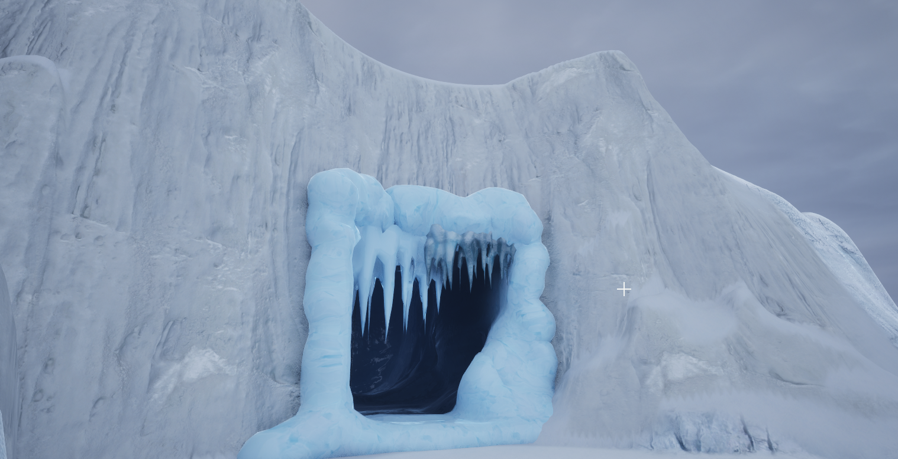

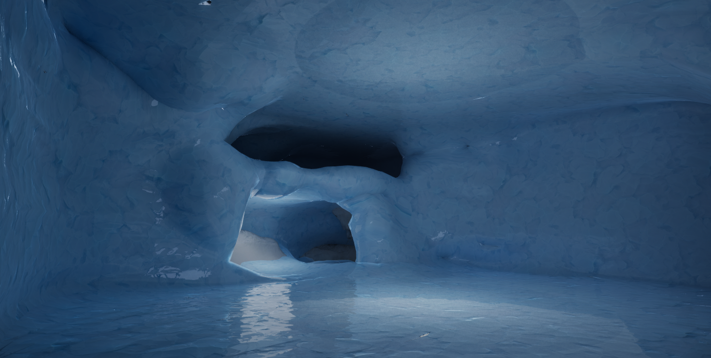

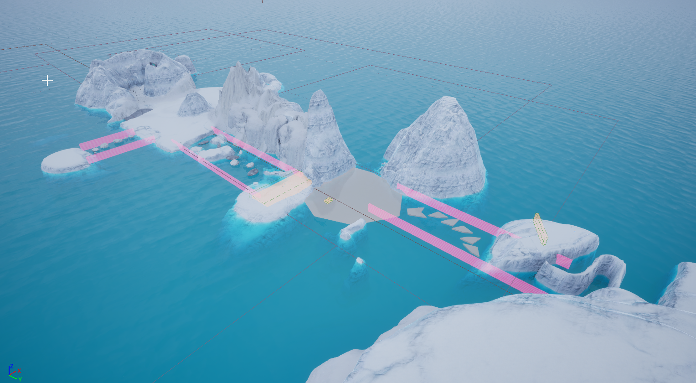
*This is how it looks like in the editor*

You can see there some sort of blocking volumes for physics objects and **triggers**. Yeah I made finally triggers that... yeah, you guess it. They can trigger misc things in the level! :D There are also:

* Trigger Hurt
* Trigger Teleport
* Trigger Push

You can read about them in the [developer documentation - triggers section](../../docs/entites/Triggers/).

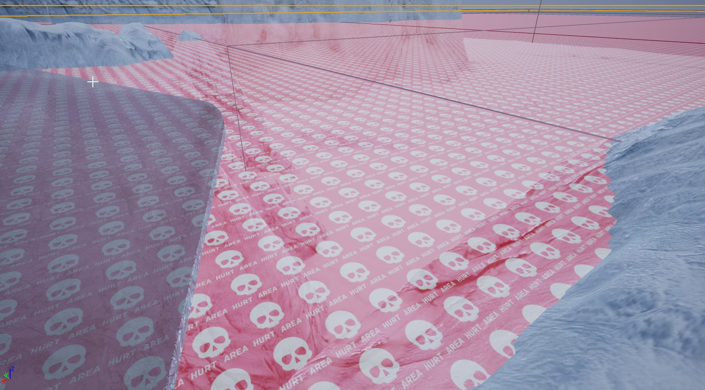

## Summary

I am very pleased of that how the things are turning out. Finally game has some playable level. I also implemented **proximity voice chat** but it needs some work, but what is most important - it works. Some day I made some playtesting with my girlfriend of this game and it was fun. It didn't crash not even once lol, what is very strange.

I implemented a lot of other stuff I didn't mentioned here. You can watch the "speedmapping" of icelands:



The next thing I want to implement are objectives and secrets. Ofcourse it should be highly customizable and map-specific. I designed some UI for it how should it look:

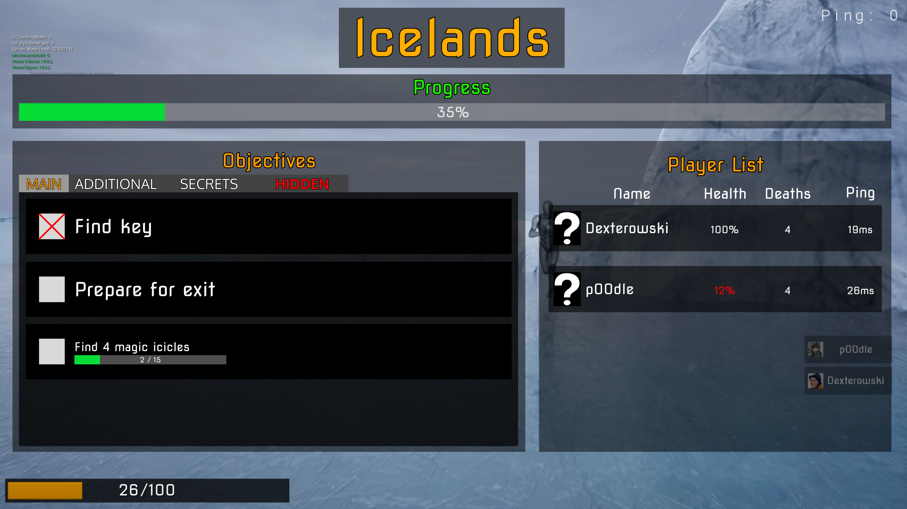

It is just an idea and prototype.