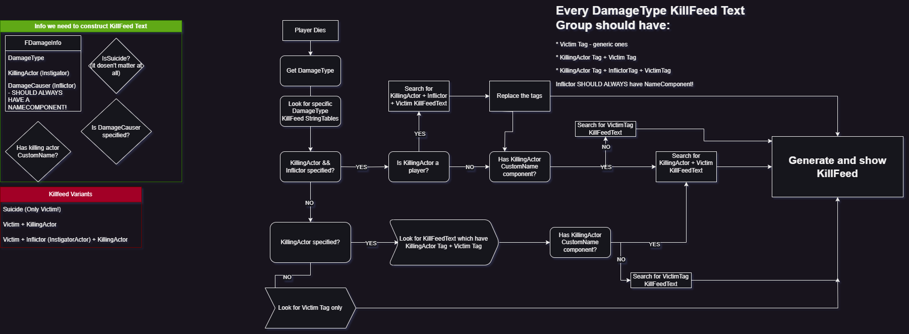
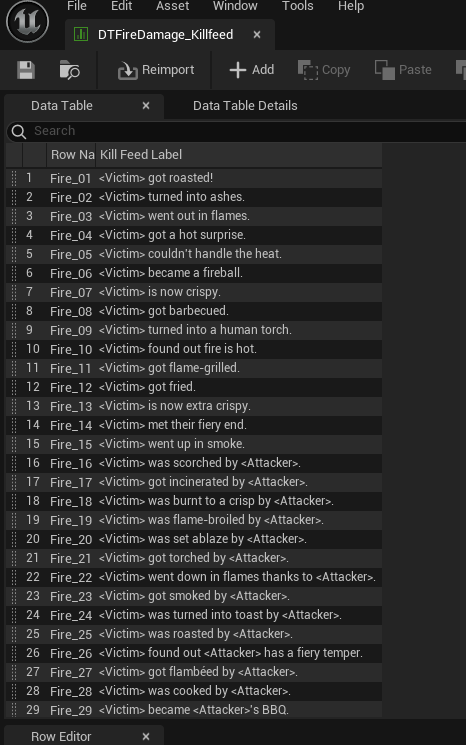
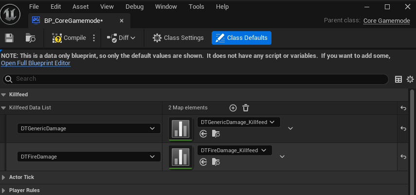
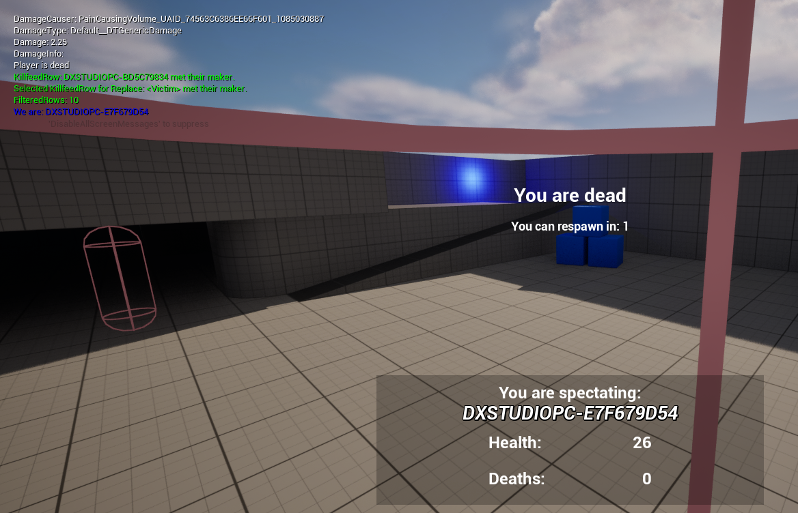
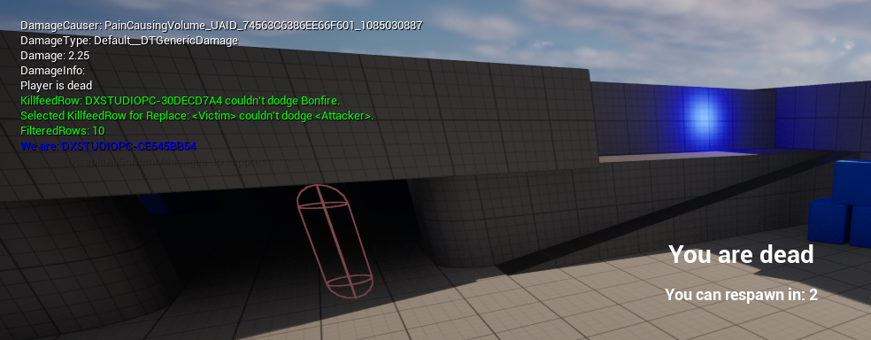
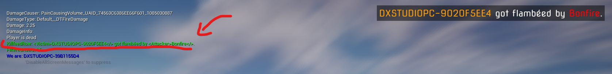
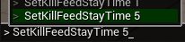

# What is killfeed?
 
Killfeed is a feautre which can you spot only in the multiplayer games. It shows the recent player or NPC deaths. It should contain informations like:
 
* Vicitm - the player, NPC who died
* Inflictor - object which contribued to player/NPC deaths
* Attacker - Player/NPC who used inflictor to kill the victim
 
You can spit killfeed in many games, Call of Duty, Counter-Strike,  Minecraft and many more
 
<center>
 

 
</center>
 
I want to create same system in my game. I had it done in previous Unreal Engine project but it was bugged. Ok, but how I want to look it like? I want to have also objects from game to be present in the killfeed if the map creator will decide for it, for example when a door will crush our player I want to have in killfeed something like this:
 
``Dexterowski was crushed by super fast door``
 

<center>

**Killfeed example in my previous project on 5.3 - it was bugged as hell**

</center>

So firstly we must code, a possibility to give gameobjects custom names. You will say: *Wait a minute, why? You can name your gameobjects in Unreal Engine Outliner*. Yes that's correct.
 
<center>
 

 
</center>
 
In editor developer can name objects for **organizational purposes**, you want to keep these names for better object searching in editor.  For example you created in your map about 30 buildings to which you can enter by the door. You will not name door ``super fast door`` for the specific building because you want to have this name present in killfeed. You will name door something like ``Building19_EntranceDoor``. That's the reason we should make custom names separately. 
 
## CustomNameComponent
 
The best option for this is to make a ActorComponent with only one variable - name. 

{}

**What is ActorComponent?**

<br>
<br>

This is as name says "Component" which can be coded and it should be working independent of the rest of the Actor (Game Object) code.

{}

So the great example will be our CustomNameComponent. It will be can added to the every game actor.

```cpp
UCLASS( ClassGroup=(Custom), meta=(BlueprintSpawnableComponent) )
class DXPUZZLES2024_API UCustomNameComponent : public UActorComponent
{
	GENERATED_BODY()

public:	
	// Sets default values for this component's properties
	UCustomNameComponent();

public:
	UFUNCTION(BlueprintPure, Category = "Custom Name")
	FORCEINLINE FString GetCustomName() const {	return CustomName;}

private:
	UPROPERTY(EditAnywhere, Category = "Custom Name")
	FString CustomName;
};

```

This is how the header file for this component looks like. When we will be constructing a killfeed we just need if an actor has "CustomNameComponent" and we will know if we must replace our "attacker" tag.

Before I decided to write any code I drawed an algorith how it should look like for building the killfeed text. With image representation it should be easier to throw it into code.

<center>



</center>

## Data Tables

I wanted my killfeed to be highly customizable. Ease of adding new texts was very important. So I decided to make something like **DataTables** for it. it is something like a database. The captions for the killfeed must vary according to the DamageType - if our player was burnt we want to display:

``Dexterowski was burnt by the -CustomNameComponent here if we want``

if player died because of fall damage we want to display something like:

``Dexterowski have now broken legs`` etc.

Each DamageType must have own misc captions for the killfeed. You will ask - How are you going to come up with so many different, funny captions for killfeed? For this task the perfect tool is - AI - ChatGPT. That's how we should use AI tools. I had to use GPT 4o model because 3.5 didn't want to generate me a CSV file. I wanted the CSV file because it's easy to import it in Unreal Engine. When I want to change something in captions or add, I am making a change in CSV and re-import - done. 

<center>



</center>

{}

Before I made the actual DataTable, Unreal Engine needed a template for this table so you must create new using ``FTableRowBase`` as parent

{}

### Connecting DamageType with correct DataTables

Next thing which puzzled me was - **How to make a specific DataTable will be associated with a specific DamageType?**. I found an answer in the few seconds - ``TMap``. It is something like a dictionary in C#. So our TMap will look something like this:

```
[DamageType] [Associated DataTable]
[FallDamage] [FallDamage Captions]
[BurnDamage] [BurnDamage Captions]
```


<center>



</center>

We will pass only the DamageType argument and our code should find the proper captions for our case. Yeah, in theory it looks simple...

## Preparation is done

Ok we have content to work on, now we should code our **Killfeed Constructor**. I called it like this because it will handle replacing tags like < Attacker > and will place other tags which will decorate our text with colors. I was wondering where is the best place to make this constructor. I didn't found better place than just a ``UBlueprintFunctionLibrary``. 


```cpp

UCLASS()
class DXPUZZLES2024_API UKillfeedConstructor : public UBlueprintFunctionLibrary
{
	GENERATED_BODY()

protected:
	static FString GetRandomRow(UDataTable* KillfeedData); // Get random row from KillfeedData without taking into account any tags
	static FString GetRandomRowWithAttackerTag(UDataTable* KillfeedData); // Get random row from KillfeedData with <Attacker> tag
	static FString GetRandomRowWithFullTags(UDataTable* KillfeedData); // Get random row from KillfeedData with full tags <Attacker>, <Victim>, <Inflictor>
	static FString GetRandomRowIncludingTag(UDataTable* KillfeedData, FString Tag); // UNUSED

	static FString GetPlayerNameFromActor(AActor* Actor);

	UDataTable* SelectDataTable(UClass* DamageTypeClass); // Selects DataTable based on DamageType (UDXBaseDamageType

public:
	FString ConstructFeed(FDamageInfo DamageInfo);

};
```

This is how KillfeedConstructor.h looks like.

Main function is ``ConstructFeed(FDamageInfo DamageInfo)``. It is being executed from ``GameState`` when player dies. GameState has variable ``KillfeedDisplayText`` which is replicated/synchronized between players so everybody will see the same caption. I made **OnRep** function which executes a code on player UI to display the killfeed. 


{}
**OnRep function** is piece of code which executes on client when variable is on the **Server** and being synchronized to the clients
{}

Firstly I did the choosing correct DataTable corresponding to DamageType. ``SelectDataTable`` does it for us.

Secondly I coded the randomization and filtered randomization of killfeed captions, then replacing the correct tags with names.

<center>



*We can see on debug messages replaced text with actual nickname, the randomized one before formatting and the number of eligible captions - in short, which contains only the "< Victim >" tag*

<br>



*Here you can see the caption with replaced Victim and Attacker tags. Attacker tag is replaced by name set in CustomNameComponent*

</center>


Here you can see the actual code of KillFeed Constructor:

{}

```cpp

// DX STUDIO 2024


#include "Core/UTILS/KillfeedConstructor.h"
#include "CoreGamemode.h"
#include "Core/BasePlayer.h"
#include "Core/BasePlayerController.h"
#include "Entities/Components/CustomNameComponent.h"

/* We must take care that when DamageInfo.InstigatedBy is not nullptr, we must treat it as a player which is the ATTACKER so we replace the <Attacker> tag with the player's name not the <Inflictor> tag! Inflictor is for example a weapon or a projectile which caused the damage.
 * When DamageInfo.InstigatedBy is nullptr, we must treat the DamageInfo.DamageCauser as the ATTACKER so we replace the <Attacker> tag with the DamageCauser's CustomName component if it exists not the <Inflictor> tag!
 * If DamageInfo.DamageCauser doesn't have CustomName component we DO NOT USE the <Attacker> tag!
*/


// Gets random row from DataTable ONLY with <Victim> tag.
FString UKillfeedConstructor::GetRandomRow(UDataTable* KillfeedData)
{
    bool bFound = false;

    TArray<FKillfeedDataRowBase*> AllRows;
    TArray<FKillfeedDataRowBase*> FilteredRows; // Rows with <Victim> tag

    KillfeedData->GetAllRows<FKillfeedDataRowBase>(TEXT("ContextString"), AllRows);

    if (AllRows.Num() == 0)
    {
        return FString("No data in DataTable: " + KillfeedData->GetName() + "!");
    }

    // Before we start randomizing , we need to check if there are any rows with <Attacker> tag
    for (int32 i = 0; i < AllRows.Num(); i++)
    {
        if (AllRows[i]->KillFeed_Label.Contains(VICTIM_TAG) && (!AllRows[i]->KillFeed_Label.Contains(ATTACKER_TAG) && !AllRows[i]->KillFeed_Label.Contains(INFLICTOR_TAG)) )
        {
            FilteredRows.Add(AllRows[i]);
        }
    }

    GEngine->AddOnScreenDebugMessage(-1, 10, FColor::Green, TEXT("FilteredRows: ") + FString::FromInt(FilteredRows.Num()));

    if (FilteredRows.Num() > 0)
    {
      /*  while (!bFound)
        {
            int32 RandomIndex = FMath::RandRange(0, FilteredRows.Num() - 1);
            if (FilteredRows[RandomIndex]->KillFeed_Label.Contains(VICTIM_TAG) && !FilteredRows[RandomIndex]->KillFeed_Label.Contains(ATTACKER_TAG))
            {
                return FilteredRows[RandomIndex]->KillFeed_Label;
            }
            bFound = false;
        }*/

		const unsigned short int RandomIndex = FMath::RandRange(0, FilteredRows.Num() - 1);
		return FilteredRows[RandomIndex]->KillFeed_Label;

    }
    return FString("No data in DataTable: " + KillfeedData->GetName() + " containing <Victim> tag!");
}

// Gets random row from DataTable with <Attacker> and <Victim> tags. There is no need for <Inflictor> tag.
FString UKillfeedConstructor::GetRandomRowWithAttackerTag(UDataTable* KillfeedData)
{
	bool bFound = false;

	TArray<FKillfeedDataRowBase*> AllRows;
	TArray<FKillfeedDataRowBase*> FilteredRows; // Rows with <Attacker> tag

	KillfeedData->GetAllRows<FKillfeedDataRowBase>(TEXT("ContextString"), AllRows);

	if (AllRows.Num() == 0)
	{
		return FString("No data in DataTable: " + KillfeedData->GetName() + "!");
	}

	// Before we start randomizing , we need to check if there are any rows with <Attacker> tag
	for (int32 i = 0; i < AllRows.Num(); i++)
	{
		if(AllRows[i]->KillFeed_Label.Contains(ATTACKER_TAG) && AllRows[i]->KillFeed_Label.Contains(VICTIM_TAG) && !AllRows[i]->KillFeed_Label.Contains(INFLICTOR_TAG))
		{
			FilteredRows.Add(AllRows[i]);
		}
	}

	GEngine->AddOnScreenDebugMessage(-1, 10, FColor::Green, TEXT("FilteredRows: ") + FString::FromInt(FilteredRows.Num()));

	if (FilteredRows.Num() > 0)
	{
		/*while (!bFound)
		{
			int32 RandomIndex = FMath::RandRange(0, FilteredRows.Num() - 1);
			if (FilteredRows[RandomIndex]->KillFeed_Label.Contains(ATTACKER_TAG))
			{
				return FilteredRows[RandomIndex]->KillFeed_Label;
			}
				bFound = false;
		}*/

		const unsigned short int RandomIndex = FMath::RandRange(0, FilteredRows.Num() - 1);
		return FilteredRows[RandomIndex]->KillFeed_Label;
	}
	return FString("No data in DataTable: " + KillfeedData->GetName() + " containing <Attacker> tag!");
}

// Gets random row from DataTable with <Attacker>, <Victim> and <Inflictor> tags.
FString UKillfeedConstructor::GetRandomRowWithFullTags(UDataTable* KillfeedData)
{
	bool bFound = false;
	TArray<FKillfeedDataRowBase*> AllRows;
	TArray<FKillfeedDataRowBase*> FilteredRows; // Rows with <Attacker> & <Victim> & <Inflictor> tags
	KillfeedData->GetAllRows<FKillfeedDataRowBase>(TEXT("ContextString"), AllRows);

	// Check if any row contains all the tags
	for (int32 i = 0; i < AllRows.Num(); i++)
	{
		if (AllRows[i]->KillFeed_Label.Contains(ATTACKER_TAG) && AllRows[i]->KillFeed_Label.Contains(VICTIM_TAG) &&
			AllRows[i]->KillFeed_Label.Contains(INFLICTOR_TAG))
		{
			FilteredRows.Add(AllRows[i]);
		}
	}


	if (FilteredRows.Num() > 0)
	{
		while (!bFound)
		{
			const unsigned short int RandomIndex = FMath::RandRange(0, FilteredRows.Num() - 1);
			if (FilteredRows[RandomIndex]->KillFeed_Label.Contains(ATTACKER_TAG) && FilteredRows[RandomIndex]->KillFeed_Label.Contains(VICTIM_TAG) && FilteredRows[RandomIndex]->KillFeed_Label.Contains(INFLICTOR_TAG))
			{
				bFound = true;
				return FilteredRows[RandomIndex]->KillFeed_Label;
			}
				bFound = false;
		}
	}
	return FString("No data in DataTable: " + KillfeedData->GetName() + " containing all the tags!");
}

FString UKillfeedConstructor::GetRandomRowIncludingTag(UDataTable* KillfeedData, FString Tag)
{
	TArray<FKillfeedDataRowBase*> AllRows;
	KillfeedData->GetAllRows<FKillfeedDataRowBase>(TEXT("ContextString"), AllRows);

	if (AllRows.Num() > 0)
	{
		for (int32 i = 0; i < AllRows.Num(); i++)
		{
			if (AllRows[i]->KillFeed_Label.Contains(Tag))
			{
				return AllRows[i]->KillFeed_Label;
			}
		}
	}

	return FString("No data in DataTable: " + KillfeedData->GetName() + " containing: " + Tag + "!");
}

FString UKillfeedConstructor::GetPlayerNameFromActor(AActor* Actor)
{
	if(Actor && Actor->IsA(ABasePlayer::StaticClass()))
	{
		ABasePlayer* Player = Cast<ABasePlayer>(Actor);
		if (Player)
		{
			return Player->GetPlayerName();
		}
		UE_LOG(LogTemp, Error, TEXT("Can't cast Actor parameter into ABasePlayer class!"))
		return FString("GetPlayerNameFromActor NULL");
	}
	UE_LOG(LogTemp, Error, TEXT("GetPlayerNameFromActor: Provided actor in params is not a player?"))
	return FString("GetPlayerNameFromActor NULL");
}

UDataTable* UKillfeedConstructor::SelectDataTable(UClass* DamageTypeClass)
{
	if(GetWorld())
	{
		ACoreGamemode* GM = Cast<ACoreGamemode>(GetWorld()->GetAuthGameMode());
		return GM->GetKillfeedDataTable(DamageTypeClass);
	}
	else
	{
		UE_LOG(LogTemp, Error, TEXT("Can't get World in UKillfeedConstructor::SelectDataTable(), UDataTable will be NULL!"))
		return nullptr;
	}
}

FString UKillfeedConstructor::ConstructFeed(FDamageInfo DamageInfo)
{
	// Matching correct DataTable with DamageType is one of the tasks, we also must choose the correct one based on that we have Player or AI as the attacker or not. We also must take account that we have CustomNameComponent for the attacker or not.
	// InstigatedBy is a Controller which is a player, DamageCauser is a weapon or a projectile which caused the damage in that case
	// If InstigatedBy is PlayerController we must get the PlayerState and then the player nickname from it.
	// If InstigatedBy is AIController we must get the AI name, or the CustomNameComponent from the Pawn if exists. Actually we do not have coded AIControllers any so it is the case for future development.
	// If InstigatedBy is nullptr, we must treat the DamageCauser as the attacker
	// If DamageCauser doesn't have CustomNameComponent we must not use the <Attacker> tag and only choose the killfeed text row witch <Victim> tag.
	// DamagedActor can be a player or AI, we must get the name from the CustomNameComponent if exists, if not we must get the name from the PlayerState if DamagedActor is a player.

	// Firstly we must get the correct DataTable based on DamageType
	UDataTable* KillfeedData = SelectDataTable(UDTGenericDamage::StaticClass());

	// Avoid case when DamageType is nullptr.
	if (DamageInfo.DamageType)
	{
		KillfeedData = SelectDataTable(DamageInfo.DamageType->GetClass());
	}


	FString KillfeedRow = "";

	if(DamageInfo.InstigatedBy && DamageInfo.InstigatedBy->IsA(ABasePlayerController::StaticClass()))
	{
		// In this case the DamageCauser is the inflictor. We do not have anything coded which will cause this situation but inflictor should also have it's own name.
		// TODO: Expand this code for Inflictor case and get it's name, for now we will use just the INFLICTOR NAME HERE string.

		ABasePlayerController* PlayerAttacker = Cast<ABasePlayerController>(DamageInfo.InstigatedBy);
		if (PlayerAttacker)
		{
			ABasePlayerState* PlayerState = PlayerAttacker->GetPlayerState<ABasePlayerState>();
			if(PlayerState)
			{
				FString PlayerName = PlayerState->GetPlayerName();

				KillfeedRow = GetRandomRowWithFullTags(KillfeedData);

				// TODO: Remove it after testing
				GEngine->AddOnScreenDebugMessage(-1, 10, FColor::Green, TEXT("Selected KillfeedRow for Replace: ") + KillfeedRow);

				FString FormattedPlayerName = FString(ATTACKER_TAG + PlayerName + END_TAG);
				FString FormattedVictimName = FString(VICTIM_TAG + GetPlayerNameFromActor(DamageInfo.DamagedActor) + END_TAG);

				KillfeedRow = KillfeedRow.Replace(TEXT(ATTACKER_TAG), *FormattedPlayerName);
				KillfeedRow = KillfeedRow.Replace(TEXT(INFLICTOR_TAG), *FString("INFLICTOR NAME HERE"));
				KillfeedRow = KillfeedRow.Replace(TEXT(VICTIM_TAG), *FormattedVictimName);

				GEngine->AddOnScreenDebugMessage(-1, 10, FColor::Green, TEXT("KillfeedRow: ") + KillfeedRow);
			}
		}
	}
	else if (DamageInfo.InstigatedBy == nullptr && DamageInfo.DamageCauser)
	{
		// Check if DamageCauser has CustomNameComponent
		if (DamageInfo.DamageCauser->FindComponentByClass<UCustomNameComponent>())
		{
			UCustomNameComponent* CustomNameComponent = DamageInfo.DamageCauser->FindComponentByClass<UCustomNameComponent>();
			if(CustomNameComponent)
			{
				const FString CustomName = CustomNameComponent->GetCustomName();
				KillfeedRow = GetRandomRowWithAttackerTag(KillfeedData);

				FString FormattedPlayerName = FString(ATTACKER_TAG + CustomName + END_TAG);
				FString FormattedVictimName = FString(VICTIM_TAG + GetPlayerNameFromActor(DamageInfo.DamagedActor) + END_TAG);

				KillfeedRow = KillfeedRow.Replace(TEXT(ATTACKER_TAG), *FormattedPlayerName);
				KillfeedRow = KillfeedRow.Replace(TEXT(VICTIM_TAG), *FormattedVictimName);
				GEngine->AddOnScreenDebugMessage(-1, 10, FColor::Green, TEXT("KillfeedRow: ") + KillfeedRow);
			}
		}
		else
		{
			FString FormattedVictimName = FString(VICTIM_TAG + GetPlayerNameFromActor(DamageInfo.DamagedActor) + END_TAG);
			

			KillfeedRow = GetRandomRow(KillfeedData); // We are getting only the row which only contains <Victim> tag.
			// TODO: Remove it after testing
			GEngine->AddOnScreenDebugMessage(-1, 10, FColor::Green, TEXT("Selected KillfeedRow for Replace: ") + KillfeedRow);
			KillfeedRow = KillfeedRow.Replace(TEXT(VICTIM_TAG), *FormattedVictimName);
			GEngine->AddOnScreenDebugMessage(-1, 10, FColor::Green, TEXT("KillfeedRow: ") + KillfeedRow);
		}
	}

	return KillfeedRow;
}


```

{}


These things I mentioned above was the **hardest** part for me. Creating the UI with text-formatting was the easiest part.

Besides of replacing victim, attacker tags I had to **ADD** text-formatting tags which will colour our text for the specific colors.

<center>



</center>

So if it works this is the time to create some nice animations:

<center>



</center>


Working with "modular" UIs looks like this:

<center>



</center>

By accident whole container of killfeed text fullscreened.

Test with another player, but here the formatting is not working yet:

<center>



</center>

### And the final result:

<center>



</center>

On one player screen killfeed UI item is disappearing faster because of that I was testing the **console variables** and I made a possibility to change the duration of displaying killfeed by the CVAR - aand now I should start making a documetation for my game... I think.

<center>



</center>

It looks nice, text is always formatted - in my previous version it was bugged and text wasn't formatting and I didn't know why. Doing something for a second time always turn out to be better

**Known bug:** When Player 1 is alone on the server and will die, then Player 2 will join (after Player 1's death) the Killfeed will be displayed no matter what - that's caused of ``KillfeedDisplayText`` variable initial replication. I do not have idea how to fix this but there must be the way to do it somehow. I know there are custom conditions to make in variable replications but I am tired of this system for now xD
