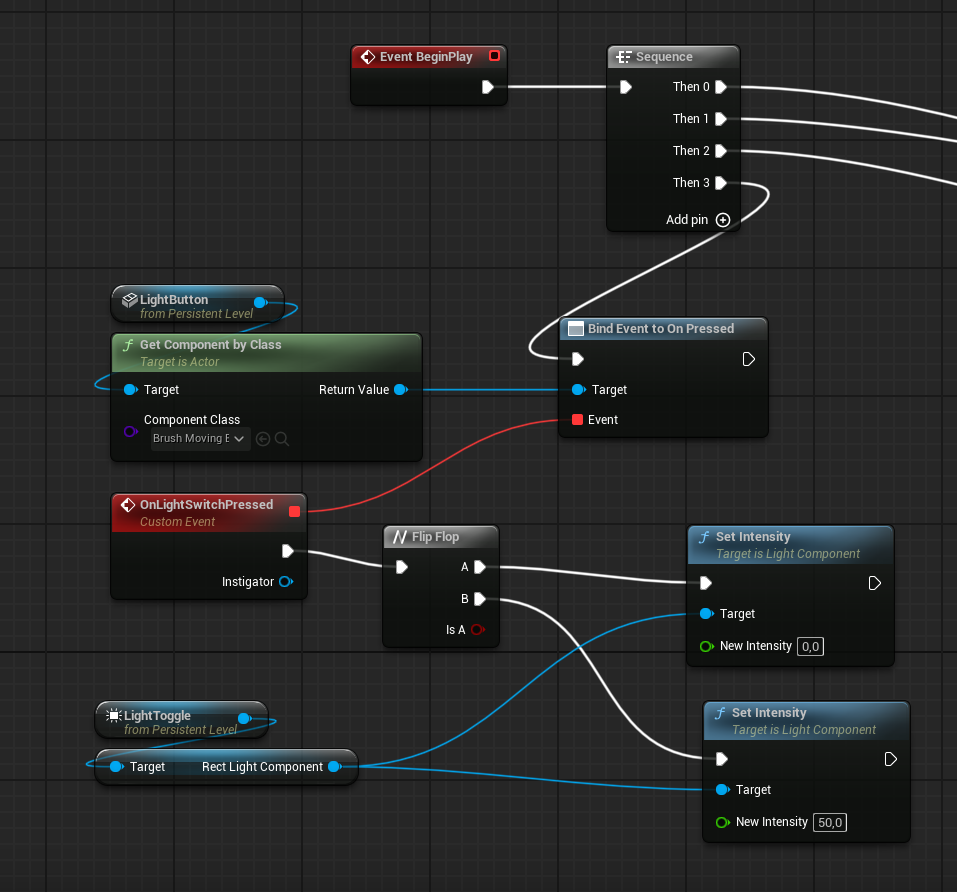

# Fixed Half-Life GoldSrc-Like ladders

This type of ladder was bugged a lot - espacially over network. Movement modes wasn't switching for players and I learned next thing about writing custom movement code. I have to fix a lot of stuff in my net-code but I will get back to this later. My ladder movement code was bugged because I was sending from client variables like `bIsLadderClimbing` **EVERY FRAME**. This is not how it should be done.

DXBaseMovementComponent.cpp
```cpp
void FSavedMove_DXMovement::PrepMoveFor(ACharacter* Character)
{
	Super::PrepMoveFor(Character);
	UDXMovementComponent* CharMov = Cast<UDXMovementComponent>(Character->GetCharacterMovement());
	
	if (CharMov)
	{
		CharMov->bWantsToSprint = bSavedWantsToSprint;
		CharMov->bStaminaCanRegenerate = bSavedStaminaCanRegenerate;
		CharMov->Stamina = SavedStamina;

		CharMov->bIsFullySubmerged = bSavedIsFullySubmerged;
		CharMov->bIsTouchingWater = bSavedIsTouchingWater;
		CharMov->WaterLevel = SavedWaterLevel;
		CharMov->DXCustomMovementMode = static_cast<TEnumAsByte<EDXMovementMode>>(bSavedDXMovementMode);

		//CharMov->bIsLadderClimbing = bSavedIsOnLadder;
		//CharMov->LadderNormal = SavedLadderNormal;
		CharMov->CurrentLadder = SavedCurrentLadder;

		CharMov->PlayerForwardInput = SavedPlayerForwardInput;
		CharMov->PlayerRightInput = SavedPlayerRightInput;

		CharMov->ViewPlaneNormal = SavedViewPlaneNormal;
		CharMov->ViewPlaneRight = SavedViewPlaneRight;

		// Source Ladders
		CharMov->SourceLadder_StartPoint = Saved_SourceLadder_StartPoint;
		CharMov->SourceLadder_EndPoint = Saved_SourceLadder_EndPoint;

		CharMov->bIsOnSourceLadder = bSavedIsOnSourceLadder;
		CharMov->bIsGettingOnOrOffLadder = bSavedIsGettingOnOrOffLadder;

		CharMov->DismountPosition = SavedDismountPosition;
	}
}
```

See this commented out lines? That was causing my problems with player ladder movement. As you can see I am stupid as shit. I must remove these variables from this place. These are *stateful* so I want them set only once in necessary place. There are a lot of redundant variables here which would wase a lot off network traffic.

# [Source-like ladders](https://dxpuzzles.com/docs/entites/point-actors/sourceladder/)

Finally I added also Half Life 2 ladders. I think this is the best ladder movement system for FPP games. I am attaching video below how it works:

<video controls muted loop="true" autoplay="true" src="UnrealSourceLadders_VID2.mp4" width="100%" title="Source-like ladders presentation"></video>

As you can see there are `StartPoint`s and `EndPoint`s. Additionaly I made `LadderDismount`s which are helper components which sets the "exit" position from the ladder. They are being automatically recognized by movement system if some are nearby.

Also in [GoldSrc Ladder](https://dxpuzzles.com/docs/entites/brush-entites/brushladder/) and [Source Ladder](https://dxpuzzles.com/docs/entites/point-actors/sourceladder/) we can choose type which is setting proper footstep sound set for them.

So ladders are properly functional (I hope) and replicated over network. More info you can find in [documentation](https://dxpuzzles.com/docs/)

# Footsteps

<video  controls src="Footsteps pres.mp4" width="100%" title="Footsteps"></video>

Over this period of time I also implemented player model, animations and footstep sound system integrated with my custom [Water Actor](https://dxpuzzles.com/news/2024/06/finally-working-water/)

Footsteps are changed depending on material. Nothing is hardcoded. Footsteps in water also emit particles but they need some work and polishing.

# More water work

Now swimming in this game and using the water is fun. I added some sound effects when player is underwater, water impacts when he is jumping into water and many others

<video controls src="DXPuzzlesWater.mp4" width="100%" title="Water presentation 01"></video>

<video controls src="WaterPresentation2.mp4" width="100%" title="Water Presentation 02"></video>

I am really happy with it. As you can see there are also swimming animations. I must also add some events for them to emit particles and sound when for e.x. player hand model hits the water surface or something.

# Interaction system



<video controls loop="true" src="InteractionSystemExample.mp4" title="Interaction system example" width="100%"></video>

When I was working on [Source Ladders](https://dxpuzzles.com/docs/entites/point-actors/sourceladder/) I was forced to add simple interaction system for my players. So I added simple networked interface `IInteractionInterface` to ladder code. Player presses the interact key and it is executing Server RPC which invokes the ``Interact()`` function on the target. 

So I went ahead and made a simple event system similar to the [Input/Output system](https://developer.valvesoftware.com/wiki/Inputs_and_Outputs) from the Source Engine. I wanted this to be handled by level blueprint to have more freedom over what can be done with them. I am still wondering what proper way wouldbe to implementing this system. I think it is the topic for separate post. 

Video above also shows the power of **Lumen** :) 

# Player ragdolls

<video autoplay="true" loop="true" muted controls src="RagdollSystem.mp4" title="Ragdoll System" width="100%"></video>

After death we can watch how satisfying ragdoll is behaving with world and physics objects

# Rewrited spectating system

<video muted autoplay="true" loop="true" controls src="SpectatingSystem.mp4" title="Spectating System" width="100%"></video>

Which is less bugged and more functional now. "Chase camera" is now more smooth and pretty.

# Custom camera punch

I wanted to do simple camera effect which I had on mine Garry's Mod gamemode done and it turned out that Unreal's camera shake system... sucks. So I coded my own simple, smooth, pretty camera punch. Of course it is HL2 stylized xD

<video muted controls autoplay="true" loop="true" src="CameraPunch.mp4" title="Camera Punch" width="100%"></video>

# Player crushing

I implemented simple moveable door. It can emit sounds when **opened, fully opened, close, used, used on lock and many more**... you can set up misc properties:

<center>


</center>

<video muted controls autoplay="true" loop="true" width="100%" src="UnrealEditor_7OzyUgC3Vy.mp4" title="Player crush"></video>


but the problem was with the famous DOOR STUCK. I want that map creators will be able to set if door or moving platform can damage/crush player or not. I found some solution but it requires a lot of work because palyer can be killed whenever he stucks in the door. For example when player have high ping/latency it can be also treated as door stuck and kill the player.

**Door-stuck bug:**

<video muted controls autoplay="true" loop="true" width="100%" src="DoorStuck bug.mp4" title="Door stuck bug"></video>


I am also trying to make map creating easy and smooth and possible so I added some visualizers for entities like doors:

<center>


</center>

It is visualized in which direction door moves and how far it would slide.

# Time of Day / Weather system

I bought the [Ultra Dynamic Sky plugin](https://www.fab.com/listings/84fda27a-c79f-49c9-8458-82401fb37cfb). I think this is the best solution to have a nice weather system and time of day which is **REPLICATED** and we can also set is to synchronize with local time and geolocation. 

<video autoplay="true" muted controls src="WeatherSystem.mp4" loop="true" width="100%" title="Weather System"></video>


I thinks that's all I done in that time peroid. The next things I want to work on are:

 * Physics Entity
   * Impact Sounds
   * Particles
   * Possibility to pickup objects
   * Breakable physics objects
   * Damaging player with heavy objects
 * Custom damage system - because I noticed that Unreal's one is heavliy limiting me
 * Implementing better event system
 * Write BaseClass for entities like buttons, doors - to implement things which are in common. For example moving things should have possibility to specify blocking damage or should it stop, return when something is blocking it's movement.
 * Physics interactions with players. I hope to implement a player movement that reacts to the physical world. Example below:

What it looks like when player is **non-physical** object in the world:

<video muted controls autoplay="true" loop="true" width="100%" src="NotPhysicalMovement_Example.mp4" title="Non-physical player"></video>

and what if it is **physical**:

<video muted controls autoplay="true" loop="true" width="100%" src="PhysicsMovementExample.mp4" title="Physical player"></video>


{}

This shows the **Mover Player Component** by **Epic Games**. It is still heavliy experimental feature.

{}