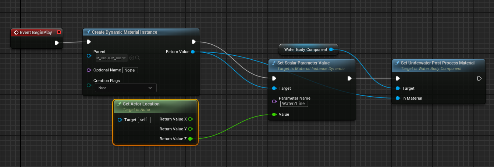

Unreal Engine have a plugin which is \**experimental*\*. This plugin can make easliy rivers, oceans, lakes... and yeah. Not pools or any other custom shaped water. I mean this plugin was bugged in 5.3 version of Unreal but let's see how it is going in 5.4

<center>


</center>

## What was bugged in 5.3 in Water System?

Especially a **underwater** post processing volume which just didn't work on **Water Plane** type. 

{}
### What is post-process volume?

A **post-process volume** in Unreal Engine is a tool used to apply various visual effects to the entire scene or a specific area within the game. Imagine it as a filter that you can apply to your camera's view to change how everything looks. Here's a simplified breakdown:

1. **Visual Enhancements**: Post-process volumes can enhance the visual quality of a game by adjusting colors, contrast, brightness, and other visual parameters. This can make a scene look more realistic, dramatic, or stylized.

2. **Effects**: You can use post-process volumes to add effects like bloom (a glow around bright areas), depth of field (blurring distant or close objects to simulate camera focus), motion blur, and lens flares.

3. **Local or Global Application**: These volumes can be applied globally (affecting the whole game world) or locally (affecting just a part of the game world). For example, you might have a post-process volume that only affects the inside of a building to give it a distinct mood or atmosphere.

4. **Blending**: You can blend multiple post-process volumes smoothly. As a player moves from one area to another, the visual effects can transition seamlessly, enhancing the immersion.

5. **Customization**: Game developers can customize the settings within the post-process volume to achieve the desired look and feel, adjusting parameters like exposure, color grading, vignette (darkening the edges of the screen), and more.

In essence, a post-process volume is like an advanced photo filter that game developers use to control and enhance the visual presentation of their game, creating specific atmospheres and improving the overall aesthetic appeal.


*redacted by ChatGPT* :joy:
{}

So without working underwater post-process it is useless because the rest is just a plane with nice water material. All the swimming movement I must do by myself and that is what we gonna do today.


### First of all I need example map

I have some builded map with simple pools to test everything. It's made in [Hammer Editor](https://developer.valvesoftware.com/wiki/Valve_Hammer_Editor)


For now it can be, lightning is so freaking ugly.


Ok I placed a water body custom aaaand..

{}


**Underwater post-process has been fixed? I don't belive that shit**

{}

{}


ok, not really :()
{}

So I must made custom one ehhh :( Ok so let's do first...

I need custom one because I must manually make a collision box + post process volume to make it work correctly.

What if... just make a global underwater post process volume and set it  to gamemode configuration, then just make in specific water bodies ability to override this to custom one and code it in that way when player is fully submerged it will be enabling that postprocess volume? This way is more practical because, instead of changing each underwater volume separately when we want to make a change we can change the "global" one.

I am wondering if I need really the custom water component one because there is on all water actors "WaterComponent".

Ok let's firstly make a...

## Swimming

I need some sort of variable which will be indicating switching my custom movement modes like ladders, swimming, water wade etc. It must be implemented because in swimming we want to swim, while water wade we want to limit the movement speed and also jumping force. That's must be coded in Movement Component, same way as I did the [sprinting and stamina](../../CustomMovement/index.md).


```cpp

UENUM(BlueprintType)
enum EDXMovementMode
{
	DXMOVE_NONE = 0,
	DXMOVE_SPRINT = 1,
	DXMOVE_SHALLOWWATER = 2, // For shallow water footsteps sound & particles
	DXMOVE_DEEPERSHALLOW_WATER = 3, // For deeper water footsteps sound & particles
	DXMOVE_WADEWATER = 4, // For wading water, sounds and limiting movement
	DXMOVE_UNSUBMERGED_SWIM = 5, // For indicating that player is swimming but not fully submerged
	DXMOVE_FULLYSUBMERGED_SWIM = 6, // For indicating that player is fully submerged
	DXMOVE_LADDER = 7,
};


```

I have prepared enumation for my custom movement modes which will be indicating how our player should behave in ceratin situations but also we will need built-in movement mode to made it properly and "safe".


Oh I forgot about **Physics Volume** which is also needed to make swimming work, without it the movement mode switching to swimming is not possible... maybe we will override this and change it?

The one of the most important things is correctly calculating **Water Level**. We need to by precise because we must know EXACTLY when player is above/belove water surface.

So I made the ``CalculateWaterLevel`` function in ``ABasePlayer`` class which is only updated when:

```cpp
	if(bIsTouchingWater && ActualWaterBody)
	{
		// Not replicated
		CalculateWaterLevel();
	}
  ```

Basically for calculating water level code is simple:

```cpp
void ABasePlayer::CalculateWaterLevel()
{
	float difference = 160.0f; // difference between feet and PlayerView (camera)
	float WaterPosZ = ActualWaterBody->GetActorLocation().Z;
	float PlayerEyePosZ = PlayerView->GetComponentLocation().Z;

	WaterLevel = (WaterPosZ - PlayerEyePosZ) + difference;
}
```


  <video src="UnrealEditor-Win64-DebugGame_B4TiSswB73.mp4" loop="true" autoplay="true" width="100%" title="Water Prototype"></video>

  {}

  When you are making **Physics Volume** with checked **Is Water Volume** built-in CharacterComponent will switch movement mode to swimming automatically

  {}


 > Ok maybe it should be done in MovementComponent :thinking:

<center>

  I moved it into MovementComponent but didn't prediction yet. That how it looks like:

  <video autoplay="true" loop="true" src="UnrealEditor-Win64-DebugGame_lN7apAVklw.mp4" width="100%" title="Water info without prediciton"></video>

I am wondering if will be there a difference.

<hr>

Ok I tried and now nothing works XD

<video autoplay="true" loop="true" src="UnrealEditor-Win64-DebugGame_i2dFjGm5kG.mp4" width="100%" title="Not working prediction"></video>

</center>

I think I forgot about data serialization (whatever that means lol)

```cpp
	SerializeOptionalValue<float>(Ar.IsSaving(), Ar, SavedWaterLevel, 0.0f);
	SerializeOptionalValue<bool>(Ar.IsSaving(), Ar, bSavedIsFullySubmerged, false);
	SerializeOptionalValue<bool>(Ar.IsSaving(), Ar, bSavedIsTouchingWater, false);
	SerializeOptionalValue<uint8>(Ar.IsSaving(), Ar, bSavedDXMovementMode, 0);
```

Ok, that wasn't the problem... wtf is going on. I have one suspicion what might have been the problem. I replicated all the variables **EXCEPT VAR WHICH STORES ACTUAL "WATER BODY"**. This variable is set from the server in ``ABasePlayer`` and my code is always checking if is it not *NULL*. Without replication on the client it is ALWAYS null so it can't calculate anything


See? The first check. Let's try to make it replicated and see what happens.

Same shit. What the hell is going on... That's the reason WHY YOU SHOULD KNOW HOW THE NETWORK PREDICITON WORKS :joy:


<hr>

Ok I think the problem is in the switching ``bIsTouchingWater`` variable to true - because it is not switching and the whole code also fails without this flag. 

I was switching it only in the server and I do not know if this is appropriate approach. Overlap events all called on every clients so I will try to make it without server RPC.

<center>

<video autoplay="true" loop="true" src="NVIDIA_Share_aMBt3oa5qL.mp4" width="100%" title="Solved Issue with Water params prediction"></video>

</center>

Yes it works know almost perfectly for ~250ms ping. You can compare the first video when variables was changing with a very big delay, with this one.

I forgot to expose to blueprints certain events - Must do it because I wouldn't have a possibility to hook up an effects like particles and sounds xD but we'll make this later

What I need to do?

* Bind Swim Up/Down actions
* Make Post Processing Volume toggling while fully submerged
* Adjust movement speeds and reduce jumping force while ``DXMOVE_WADE``


### Bind actions

```cpp

void ABasePlayer::SwimDown(const FInputActionValue& Value)
{
	if(DXBaseMovementComponent->GetDXMovementMode() == DXMOVE_FULLYSUBMERGED_SWIM || DXBaseMovementComponent->GetDXMovementMode() == DXMOVE_UNSUBMERGED_SWIM)
		AddMovementInput(FVector(0, 0, -1), DXBaseMovementComponent->SwimSpeedMultipler);
}

void ABasePlayer::SwimUp(const FInputActionValue& Value)
{
	if (DXBaseMovementComponent->GetDXMovementMode() == DXMOVE_FULLYSUBMERGED_SWIM || DXBaseMovementComponent->GetDXMovementMode() == DXMOVE_UNSUBMERGED_SWIM)
		AddMovementInput(FVector(0, 0, 1), DXBaseMovementComponent->SwimSpeedMultipler);
}


```

I think this should be enough. Let's test this out.

Of course I forgot to bind these:


... and still not working

... because I forgot about binding events

```cpp
EnhancedInput->BindAction(SwimUpAction, ETriggerEvent::Triggered, this, &ABasePlayer::SwimUp);	EnhancedInput->BindAction(SwimDownAction, ETriggerEvent::Triggered, this, &ABasePlayer::SwimDown);
```

{}
Don't know why but **ETriggerEvent::Ongoing** is not working
{}


<center>

<video autoplay="true" loop="true" src="NVIDIA_Share_PyFW7YhRQn.mp4" title="Swimming"></video>

</center>


### Post Process

This is the thing I think I will be thinking the most how to workaround it. Mine idea with global post process volume is bad because the **post process material** behaves strange

<center>


</center>

How this post process material works I do not have fucking idea. 

<hr>

Ok I found out that *Water Z* parameter in material sets when te water line is. In material blueprint I found something like this:
<center>


</center>

I think that making an own underwater post process volume which will behave normally would be easier :thinking: We can still use that amazing water surface materials.

## Second day

I started with researching how to make custom underwater post process material to have a point how the "water line" is done. I did some with a tutorials on the internet and now I have the effect:

<video autoplay="true" loop="true" src="UnrealEditor_uSBSo7DL5T.mp4" width="100%" title="Simple Underwater PostProcess"></video>

So I learned new thing: **How to change the material parameter in runtime**. For a moment when I was searching tutorials for this one I thought this is not possible xD In Unity it was easier but in Unreal Engine it is more.. organized?

<center>


</center>

As you can see there is some node like *MPC_WaterLineHeight*, this is separate asset type which is called **Material Parameter Collection**

<center>


</center>

Here we can add parameters which we will be able to change in runtime. 

{}
We must take into account that when we will use for example *MPC_WaterPPVolume* in the other material as parameters it will be changed there also because we change the paramateres not in the material itself, but in material parameter collection asset!
{}

{}
**AND THAT'S THE REASON IT WOULD NOT WORK WITH SEPARATE WATER INSTANCES - THIS APPROACH IS ALSO WRONG!**
{}

and then in our Water Blueprint simple we are setting the Actor Z location (height) as our parameter:

<center>


</center>

It works as intendent but my post process is ugly, let's see if I can modify the Unreal's one to this case.

**Yeah I CAN**

<video autoplay="true" loop="true" src="UnrealEditor_Nq0qP8JKG4.mp4" width="100%" title="Fixed Custom Mesh Underwater Post Process"></video>

## Fix built-in UE5's Underwater Post-Process Volume

What you must do is just **duplicate the original underwater post process volume material**

<center>


</center>

make a new blueprint class as child of WaterBodyCustom and on BeginPlay set the Actor Z value as Water Height parameter.

Ok but... this will work only for one instance of water, when we will make second one on another Z position it will be break and only one will work as it should. Hmm.

## Dynamic Material Instance is way to go. - Correct approach

So let's back to our custom underwater post process material and edit it in the same place again:

<center>


*Just create a new parameter and name it somehow*

</center>

For material that's all. Our blueprint class needs tweak also. Let's open it.

We need do something like this:

<center>



</center>

As the node name says it is **creating dynamic material instance** so basically it is a copy for a runtime which we can edit on the fly and set our parameters. After setting parameters we must apply it as our post process material for water body component. Now we can have two instances of water with different height levels and it works.

<video autoplay="true" loop="true" src="UnrealEditor_IewKaOUzmT.mp4" title="Different water levels" width="100%"></video>


{}
With same approach we can easliy change water fog color and any other parameters which can be just set in water instance
{}

{}

Thanks to this way we don't have to create a million different materials for every single water we will have on the
level, we can simply set all the parameters on the water instance and the game will do everything for us

{}
Why am I testing it on this level instead of pools I've created? lol.