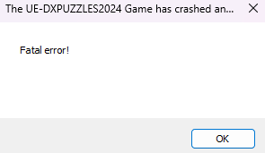
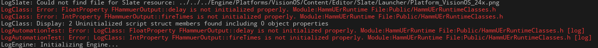
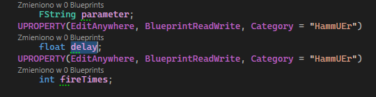
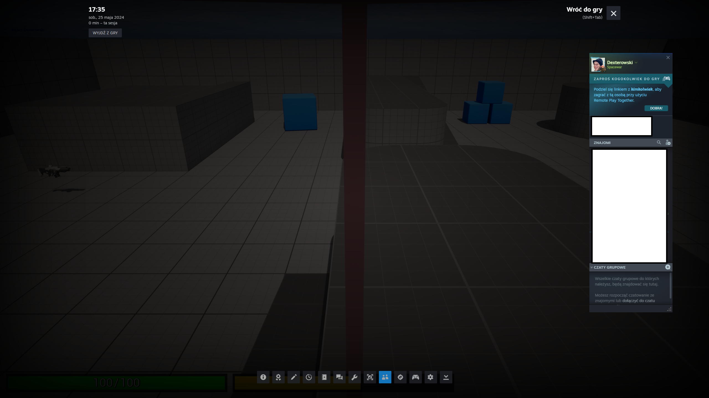
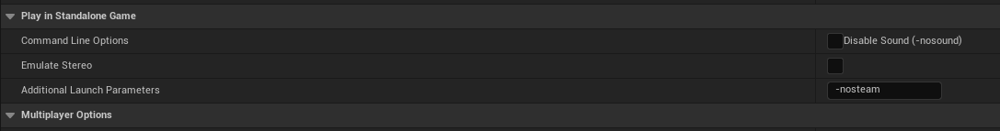

Swoją wiedzę której nie mogę znaleźć w internecie pozyskuję z Discorda [Unreal Source](https://discord.gg/unrealsource). Tam pytam o rzeczy których nie wiem. Dowiedziałem się od tej społeczności, że raz na jakiś czas dobrze jest zrobić build gry aby sprawdzić czy wszystko działa jak należy w finalnym produkcie

{}

<strong>BUILD</strong> - packaged game to executable file which can be run without editor. It is something like "final" product of the game which we have after installation. Do not confuse with for e.x. character build like in MMORPG's

{}


So I tried to build my game to test it out and... build was successful but I can't run it because of some "fatal error" without any reason, explaintation what you can see on the image below:

<center>



</center>

I checked logs for a reason what can be causing this behaviour and I found something:

<center>


</center>

It looks like engine has problem with my custom **STRUCT** named ``FDamageInfo``. I jumped into code and, yeah. I didn't initialized a default values what is unwanted thing in C++.  When we do not initialize variables it gets filled with random memory junk.

```cpp
USTRUCT(Blueprintable)
struct FDamageInfo
{
	GENERATED_BODY()

	UPROPERTY()
	AActor* DamagedActor;

	UPROPERTY()
	float Damage;

	UPROPERTY()
	const UDamageType* DamageType;

	UPROPERTY()
	AController* InstigatedBy;

	UPROPERTY()
	AActor* DamageCauser;
};
```

I am gonna fix that, and logs was yelling about ```FHammuerOutput`` - that's the plugin variable. I will try fix this also. 

I declared default values for these variables and it seems be fixed:

<center>



</center>

Now the biggest problem - plugins.

<center>



</center>

There we go, variables are not initialized indeed. It seems UE5.4 (I didn't notice similar problem in 5.3?) throws errors ONLY FOR variables marked as **UPROPERTY** has no initialized value. There is few rows lower variable called

```cpp
float startTime;
```

and it also not have default value but it is not logged. 

Let's restart the engine and try to build the game.

There is no any erros in **Output Log**.

Ok build is successful. Let's check.

... aaand the same error appears. So let's keep digging.

Lol, I wanted to paste the image of an error to discord, to ask an question why it is happening but it turned out by accident I had copied the stack-trace of an **Unhandled Exception** and it pasted into discord messange box XD So we now know a lot more. But this stack-trace honestly tells me nothing.

{}

Unreal Engine automatically copies the stack-trace to clipboard.

{}

```
Fatal error!

Unhandled Exception: 0xc06d007e

0x00007ffe44d7543c KERNELBASE.dll!UnknownFunction []
0x00007ff766412ed8 DXPUZZLES2024.exe!__delayLoadHelper2() [D:\a\_work\1\s\src\vctools\delayimp\delayhlp.cpp:312]
0x00007ff7661edd0c DXPUZZLES2024.exe!_tailMerge_steam_api64_dll() []
0x00007ff75b198a5e DXPUZZLES2024.exe!UClass::CreateDefaultObject() []
0x00007ff75b544f5b DXPUZZLES2024.exe!UObjectInitialized() []
0x00007ff75b528372 DXPUZZLES2024.exe!ProcessNewlyLoadedUObjects() []
0x00007ff7621cda67 DXPUZZLES2024.exe!FEngineLoop::PreInitPostStartupScreen() []
0x00007ff7621c7838 DXPUZZLES2024.exe!GuardedMain() []
0x00007ff7621c7aba DXPUZZLES2024.exe!GuardedMainWrapper() []
0x00007ff7621ca685 DXPUZZLES2024.exe!LaunchWindowsStartup() []
0x00007ff7621dace4 DXPUZZLES2024.exe!WinMain() []
0x00007ff766416a2a DXPUZZLES2024.exe!__scrt_common_main_seh() [D:\a\_work\1\s\src\vctools\crt\vcstartup\src\startup\exe_common.inl:288]
0x00007ffe461f257d KERNEL32.DLL!UnknownFunction []
```

Ok, guys in Discord pointed me to C++ constructors. I have something in one of them which I shouldn't have. I must take a look at every one constructor.. uh. What if is it a some plugin?

# Found solution - SteamSessions plugin

Yeah it was caused by SteamSessions plugin - but why? I added this plugin to the project but I never configured it. Added configuration lines to **DefaultEngine.ini** file and it worked.

```
[/Script/Engine.GameEngine]
+NetDriverDefinitions=(DefName="GameNetDriver",DriverClassName="OnlineSubsystemSteam.SteamNetDriver",DriverClassNameFallback="OnlineSubsystemUtils.IpNetDriver")

[OnlineSubsystem]
DefaultPlatformService=Steam

[OnlineSubsystemSteam]
bEnabled=true
SteamDevAppId=480

; If using Sessions
; bInitServerOnClient=true

[/Script/OnlineSubsystemSteam.SteamNetDriver]
NetConnectionClassName="OnlineSubsystemSteam.SteamNetConnection"
```

As you can see the steam overlay works and game also:

<center>



</center>

but there is also another problem - my health isn't updated to the gamerules value which I set. Why? Another problem with game objects initialization. But I think I will handle this later because for full testing I need a working menu with possibility to joining hosted sessions by players. For now I can't play with second player to test, only in editor.


{}

If you have problem in editor with Steam Sessions that player is not joining to the sessions, you must in **Editor Settings** add in additional launch parameters ``-nosteam`` :



{}