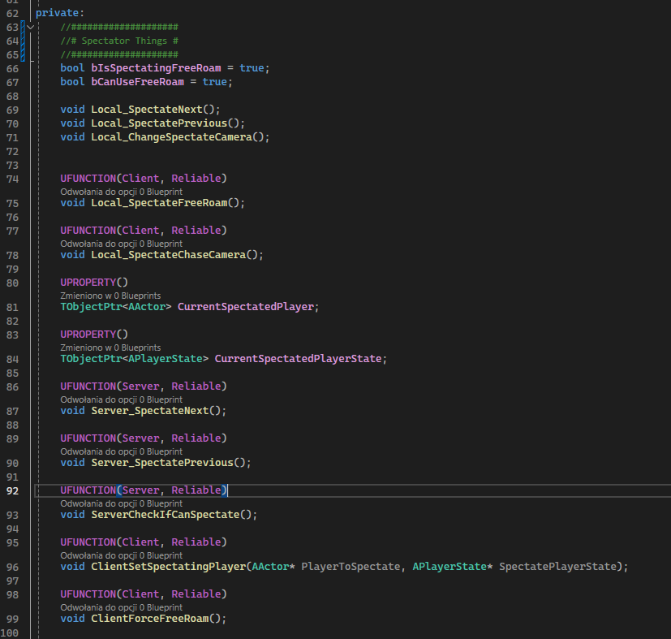

# Spectating system

As I mentioned before, I had to move all the code to the controller. However, as it turned out later, maybe not. If someone is looking for an actual tutorial on how to implement a spectating system, [I refer you here.](https://wizardcell.com/unreal/spectating-system/)

Interestingly, this tutorial shows how to do it using ``SpectatorPawn``, not ``PlayerController`` as I did.

Currently, **SpectatorPawn** class only initializes the initial properties and has functions to assign the currently observed player variable so we can "attach" the SpectatorPawn to them. That's all that remains from the SpectatorPawn code at the moment.

<center>


</center>

The real mess starts in the controller, as I mentioned. I moved all the Server RPC functions that checked and fetched the variable player to spectate, and combined them with the Client RPC functions that send information to ``BasePlayerHUD`` and ``SpectatorPawn``.


I don't remember if I mentioned earlier, but I also created a variable that forces the spectating mode to **Chase Camera** – I think Free-Roam might be problematic on some maps, as the player could fly around after death and find solutions to puzzles, for example. Hence the idea to force this mode. It still needs some polishing, because after death, the camera doesn't immediately switch to spectating a player, it only happens when we click spacebar or left mouse button. Now I think it might be useful to define some points on the map that would serve as default "Spectate Points" for observers who don't want to use the **Chase Camera** mode. I'll get back to that later.

Unfortunately, I made a mess in the code again and I'm not happy with it. I tried to keep it organized as best as I could, but I'm not the best at it...

<center>



</center>

## Respawn Timer


I made a working timer that counts down the time until the player can respawn. I didn't even know you could use such timers in C++, and it looks something like this:

In the header or .cpp file, we declare a "TimerHandle" that will allow us to handle this timer:

```cpp
FTimerHandle RespawnTimerHandle;
```

and the .cpp file looks as follows:

```cpp
void ABasePlayerState::RespawnTimerTick()
{
	ABasePlayerController* PC = Cast<ABasePlayerController>(GetOwningController());

	if(PC)
	{
		if(RespawnTimer > 0)
		{
			RespawnTimer--;
			PC->UpdateRespawnTimer(RespawnTimer);
			OnRep_SpawnTimer();
		}
		else
		{
			PC->UpdateRespawnTimer(RespawnTimer);
			OnRep_SpawnTimer();
			CanRespawn = true;
			GetWorldTimerManager().ClearTimer(RespawnTimerHandle);

			PC->ServerSetSpectatorWaiting(true);
		}
	}
}

void ABasePlayerState::StartRespawnTimer_Implementation(float TimeToRespawn)
{
	ABasePlayerController* PC = Cast<ABasePlayerController>(GetOwningController());

	if(PC)
	{
		PC->UpdateRespawnTimer(TimeToRespawn);
		OnRep_SpawnTimer();
	}

	CanRespawn = false; // should it be here?
	RespawnTimer = TimeToRespawn;
	GetWorldTimerManager().SetTimer(RespawnTimerHandle, this, &ABasePlayerState::RespawnTimerTick, 1.0f, true);
	
}
```

As we can see, we have the Server RPC ``StartRespawnTimer``, which is called from the ``BasePlayer`` class when the player dies. We "bind" the timer to the ``RespawnTimerTick`` function, which will also be executed only on the server. (cause it is called from srv, logic lol). This function will run every second according to how we configured it. Every second, we update the player's UI, which in short, is just a text showing how many seconds remain until we can respawn:

{}

The timer is executed in ``BasePlayerState``, because the player's object (Pawn) may not exist after death, unlike the BasePlayerState object which exists and is associated with the player's controller even if we don't have the player's object. It's a bit of a complex system, but the more we use it, the quicker we'll understand how it works.

{}

```cpp
RespawnTimer--;
PC->UpdateRespawnTimer(RespawnTimer);
```

We use the ``RespawnTimer`` variable so we know how much time is left.

# Respawn

Since the spectating system is working, it's time to finally respawn and allow player playing after death. First, we need to decide which key will be responsible for the **REQUEST** to respawn the player. That's right – we actually send a request to the server to respawn us. If the appropriate conditions are met, then the server respawns our player object.

I decided to put the code into function where player can change spectate camera mode:

```cpp
void ABasePlayerController::Local_ChangeSpectateCamera()
{
	if (!GetSpectatorPawn())
		return;

	if(OurBasePlayerState->CanRespawn)
	{
		ServerRestartPlayer();
		return;
	}
    [...]
```

As it quickly turned out, this function won't work so easily, because looking into the UE source code, we find information about the variable: ``bPlayerIsWaiting``. So, we had to set it to **true** somewhere.

I coded it in ``BasePlayerState`` class, when the respawn timer finishes counting down. When the variable is set to **true** player is able to respawn. As you might guess, having player UIs which is alive and player UIs which is spectating, there was a problem with them overlapping each other after respawn.

<center>

 

</center>

So, I made an **override** of the ``ClientRestart`` function - this is a Client RPC that is called when the player respawns.

I also modified the function that initializes our player's HUD to first check if we already have the HUD created. If we do, we check if the spectator one exists, and if it does we just hide it. I did the same for the initialization of the spectator UI/HUD (name it as you want)

<center>


</center>

So, we just need to call our UI initializaion function in ``ClientRestart``

```cpp

void ABasePlayerController::ClientRestart_Implementation(APawn* NewPawn)
{
	Super::ClientRestart_Implementation(NewPawn);

	if (GetMainHUD())
		GetMainHUD()->InitializeHUDWidget();
}

```

So, the basic respawn and spectating system works as it should, without causing any errors for now – everything will probably come out during playtests.

<center>

<blockquote class="imgur-embed-pub" lang="en" data-id="a/8f9r65l"  ><a href="//imgur.com/a/8f9r65l">Spectate &amp; Respawn System DX PUZZLES 2024</a></blockquote><script async src="//s.imgur.com/min/embed.js" charset="utf-8"></script>

</center>

We still need to see how the game behaves after releasing it to production, but I don't think that's for today. There's still a lot of work to do to get it back to the state it was in before, but I hope this time it will be done better and as it should be.

I finally managed to set up Version Control and can upload changes to **AzureDev**.


<center>


</center>

yes, I never used branches feature in GitHub, you can laugh but I was always forgetting about it. I must try someday when I will be making a "big feature" in DX PUZZLES.