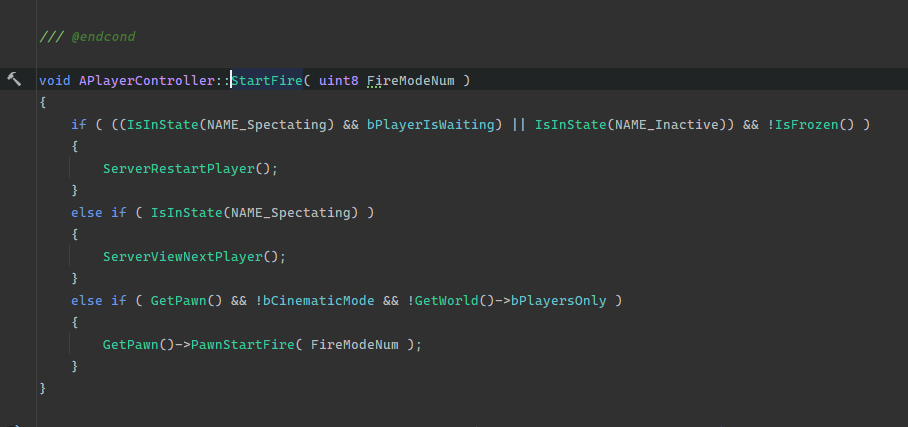
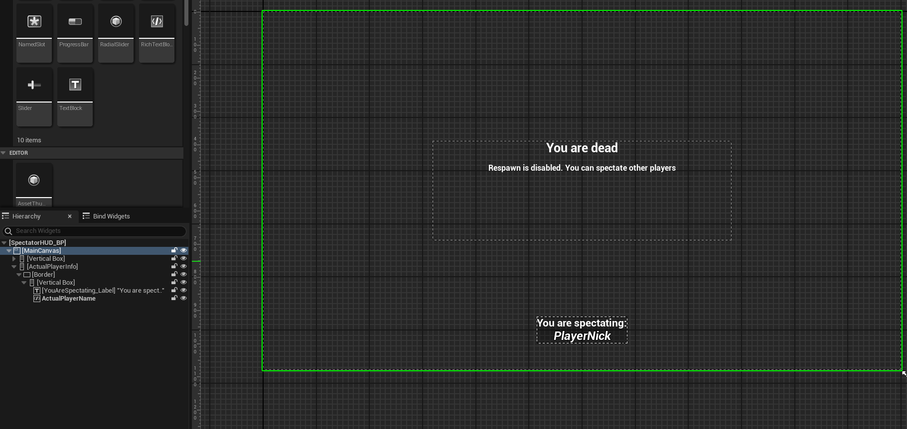



Please <strong>DO NOT</strong> treat these articles as TUTORIALS. This is DevLog - my adventure with making things in Unreal Engine 5. Thank you. Approach in this text is bad. In next post whole code will be moved into another class.



# What I want to do?

This is one of the most basic and crucial functionalities of the game itself: player death and the ability to respawn. This feature is present in most multiplayer games. In my case, I also want to introduce a system for spectating other players, depending on whether respawn is enabled and whether the map creator allows it.

The biggest challenge, I think, will be the ability to spectate other players.

I envision it working roughly like this in a very simplified form:

``` mermaid
flowchart
	n1["Map loaded"]
    n7["Player is dead"]
    n7 --- n2
	n2{"Respawn enabled?"}
    n1 --- n2
	n2 --- n3
    n3("Yes")
    n6("No")
    n3 --- n4
    n2 --- n6
    n6 --- n5
    n4["Spawn the player"]
    n5["Spawn the spectator"]
    n5 --- n2
 
 ```
  
While digging into the engine code, I found that the functionality for player spectating is already implemented, so we won't reinvent the wheel and will try to use what is already done.

To make a player a spectator, you need to call the function on the server side on the player's controller:
 
  ```cpp
  Controller->ChangeState(NAME_Spectating);
  ```

This will switch the player to spectator mode, but their player object remains in the game world. It's important to remember this. A SpectatorPawn object is spawned, which is set in the GameMode settings.

It is important to note:

  > Czy gracz może się odrodzić, a czy możemy zespawnować graczy po wczytaniu mapy to dwie różne rzeczy! W tej drugiej opcji zarządzamy stanami gry które są zarządzane przez ``AGamemode`` oraz ``AGameState``. 

It turns out that UE5 has a pre-coded player spectating functionality, which might date back to Unreal Tournament.

  

We see the variable ```FireModeNum``` — nowhere in Unreal 5 do we have a starter project with an example weapon having multiple firing modes. In FPS games, the left mouse button typically controls firing a weapon. For example, in Counter Strike, the left mouse button also switches the player being spectated — this is the same here. UE5 proposes different solutions for binding keys and actions to them. Nevertheless, it's an indication that the engine has a hard-coded player spectating functionality. So we'll leave that aside for now.

## Let's deal with player respawn... or not


The function responsible for respawn is ```RestartPlayer``` in **AGamemodeBase**. The INITIAL SPAWN is handled by the RPC function ```HandleStartingNewPlayer``` in the same class. Whether a player spawns after loading the map is controlled by the *Delayed Start* variable. Now we just need to design a system that will consider our game rule variable to determine if a player can respawn. We will also need another such variable for individual players, but more on that later.

Za respawn odpowiada funkcja ```RestartPlayer``` w AGamemodeBase. Za pierwszy spawn odpowiada funkcja RPC ```HandleStartingNewPlayer``` w tej samej klasie. To czy gracz po załadowaniu mapy nam się zespawnuje odpowiada zmienna **Delayed Start**. Teraz wystarczy dobrze zaprojektować system który będzie miał na uwadze naszą zmienną z reguł gry czy gracz może się odrodzić. Będziemy potrzebować jeszcze jednej takiej dla konkretnego gracza ale o tym potem.

In the controller, I implemented a variable that checks if the player is spawning for the first time:


```cpp
	// Is player spawned for the first time?
	UPROPERTY(Replicated)
	uint8 bIsInitSpawned = false;
```

This will allow us to bypass the rule of whether the player can respawn for the first spawn — our rule is to decide on respawn after the first death, not the first spawn.

So, we override the **RestartPlayer** function from ```BaseGamemode```. First, the RPC **HandleStartingNewPlayer** is called, as I mentioned earlier, so there's no need to check there, and we can get straight to the point:

```cpp
void ACoreGamemode::RestartPlayer(AController* NewPlayer)
{
	ABasePlayerController* BaseNewPlayer = Cast<ABasePlayerController>(NewPlayer);

	if(!BaseNewPlayer)
	{
		UE_LOG(LogTemp, Error, TEXT("Can't cast to BasePlayerController - RestartPlayer() Server Side!"));
		return;
	}

	if(!BaseNewPlayer->bIsInitSpawned)
	{
		BaseNewPlayer->bIsInitSpawned = true;
		Super::RestartPlayer(NewPlayer);
	}

	if(CanPlayerRespawn)
		Super::RestartPlayer(NewPlayer);
}
```

Everything works as it should. Now it's time for player death. In the player class, we will need a Server RPC:

```cpp
void ABasePlayer::PlayerDeath_Implementation(const FDamageInfo& DamageInfo)
{
	if (BasePlayerState)
	{
		BasePlayerState->IsAlive = false;

		BasePlayerController->ChangeState(NAME_Spectating);
		BasePlayerController->ClientGotoState(NAME_Spectating);

		GEngine->AddOnScreenDebugMessage(-1, 7.5f, FColor::White, TEXT("Player is dead"));
		GEngine->AddOnScreenDebugMessage(-1, 7.5f, FColor::White, TEXT("DamageInfo:"));
		GEngine->AddOnScreenDebugMessage(-1, 7.5f, FColor::White, TEXT("Damage: ") + FString::SanitizeFloat(DamageInfo.Damage));
		GEngine->AddOnScreenDebugMessage(-1, 7.5f, FColor::White, TEXT("DamageType: ") + DamageInfo.DamageType->GetName());
		GEngine->AddOnScreenDebugMessage(-1, 7.5f, FColor::White, TEXT("DamageCauser: " + DamageInfo.DamageCauser->GetName()));

		if (DamageInfo.InstigatedBy)
			GEngine->AddOnScreenDebugMessage(-1, 7.5f, FColor::White, TEXT("InstigatedBy: " + DamageInfo.InstigatedBy->GetName()));

	}
}
```

For debugging purposes, we leave the "Print Screen's". We used the built-in functions of UE5 — when the minimum amount of life is exceeded, the player transforms into a spectator. This is a very simplified version, but it works. After death Player Actor (GameObject) remains in the world for now but I will handle it later. The player's interface also remains, which needs to be hidden and replaced with the one the spectator should see:


* Display information on whether they can respawn, and if so, how much time is left until respawn.
* Information about what killed the player, and how much damage was dealt (cosmetic details to be added later).

It's best to inform the ```ABasePlayerHUD``` class about this through an event.

## Spectator HUD

To keep everything coherent, I'll create a basic HUD for spectators, which I mentioned earlier. For this, I created a new class inheriting from ```UserWidget``` called ```SpectatorHUD```.


I designed a simple shitty UI that looks like this:

<center>



</center>

I added code to hide the default HUD that is displayed to the player when they are alive and show the one you see above.

Next, it's time to create our own spectator class. We'll need to program switching between **Free-roam** and **Free chase** modes (these modes were probably called that in CS1.6 :D).

I'll skip coding the keyboard bindings for these actions. Unfortunately, I'm not very familiar with gathering and mapping player input. For now, I'm creating variables that store the Input Action for a given action and assigning them in the editor, whereas they should be pulled from the Input Mapping Context (I think), which is a collection of all key bindings. Maybe I'm wrong.

In an earlier project, I managed Free-Chase Camera Spectating by simply creating a second camera for my ```SpectatorPawn``` class.

```cpp
ABaseSpectator::ABaseSpectator()
{
	ChaseCamera = CreateDefaultSubobject<UCameraComponent>("Chase Camera");
	SpringArm = CreateDefaultSubobject<USpringArmComponent>("Spring Arm");

	// We need this if we want to follow camera the main object (parent, SpectatorPawn) - without it camera isn't update their position
	SpringArm->SetupAttachment(RootComponent); 

	ChaseCamera->SetupAttachment(SpringArm);
	ChaseCamera->SetRelativeLocation(FVector(-400, 0, 0));
	ChaseCamera->SetAutoActivate(false);


}
```

As we can see, we set **SetAutoActivate** to false. When our camera is active, it means we have the ChaseCamera mode enabled.

Here's the code under which I have the action to change the type of player spectating:

```cpp
void ABaseSpectator::ChangeSpectatingMode()
{
	bIsFreeRoam = !bIsFreeRoam;

	if(bIsFreeRoam)
	{
		ABasePlayerController* PC = Cast<ABasePlayerController>(GetController());
		ChaseCamera->SetActive(false);
		PC->GetMainHUD()->DisplaySpectatingPlayerInfo(false);
	}
	else
	{
		ABasePlayerController* PC = Cast<ABasePlayerController>(GetController());
		ChaseCamera->SetActive(true);
		PC->GetMainHUD()->DisplaySpectatingPlayerInfo(true);
	}
}
```

This code is shortened, it should have **safe-checks** like in ``PC`` variable. So far it looks simple and works. Now, we should make it possible to rotate the camera around the player - I haven't progammed the ability to spectate players yet, but we can move around freely, so that's enough for testing. I remember I had this done i the previous project, so maybe I'll look at how it was done there.

As it turned out, my constructor was wrong and I need to change most things. Below is the correct one.

```cpp
ABaseSpectator::ABaseSpectator()
{
	ChaseCamera = CreateDefaultSubobject<UCameraComponent>("Chase Camera");
	SpringArm = CreateDefaultSubobject<USpringArmComponent>("Spring Arm");

	SpringArm->SetupAttachment(RootComponent);
	SpringArm->TargetArmLength = 400.0f;
	SpringArm->bUsePawnControlRotation = true;
	SpringArm->bInheritPitch = true;
	SpringArm->bInheritYaw = true;
	SpringArm->bInheritRoll = true;

	ChaseCamera->SetupAttachment(SpringArm);
	//ChaseCamera->SetRelativeLocation(FVector(-400, 0, 0));
	ChaseCamera->SetAutoActivate(false);

}
```

First of all, we can't mvoe the camera using **SetRelativeLocation**. The effect is that the camera penetrates through walls. Instead, we should set the ``TargetArmLenght`` varuable on the ``SpringArm`` component, which will appropriately move the camera back, and then collision will work correctly. The next thing is setting variables to make our camera "arm" rotate around the player we are specate- this gives a nice orbital rotation effect around the object. Now, we just need to "attach" our spectator to the player we want to specate.

I managed to do something, but I have a problem with the camera getting blocked by the player's collision. It will work, but I need to set it so that the camera doesn't collide with the player because it goes into ther "center point".

For now it looks like this:

<center>

<blockquote class="imgur-embed-pub" lang="en" data-id="a/ey9v0KQ"  ><a href="//imgur.com/a/ey9v0KQ">Player Chase Spectating Bug</a></blockquote><script async src="//s.imgur.com/min/embed.js" charset="utf-8"></script>

</center>

Okay, I found it. You need to add this to the player's capsule component. 

```cpp
GetCapsuleComponent()->SetCollisionResponseToChannel(ECC_Camera, ECR_Ignore);
```

<center>

<blockquote class="imgur-embed-pub" lang="en" data-id="a/hX9GpCg"  ><a href="//imgur.com/a/hX9GpCg">Working player spectating</a></blockquote><script async src="//s.imgur.com/min/embed.js" charset="utf-8"></script>

</center>

Now, just add updating other player nicknames to the UI and make switching players loop. Now, it looks like the left mouse button switches to the *NEXT* player and the right mouse button switches to the *PREVIOUS* one. I want it so that when there's no next player to observe, it returns to the initial one.

## Replication Problem (Synchronization)

Of course, not everything could go smoothly. I programmed the ability to spectate players, switch between Free-Roam and Chase-Camera modes, but the problem occurs when, AS A CLIENT you want to spectate other players. This function doesn't work, and the Unreal Log Shows me the message:

```LogNet: Warning: Client is absorbing remote function ServerSpectateNext on actor BP_BaseSpectator_C_0 because RemoteRole is ROLE_None```

I guess my actor (GameObject) – the spectator object – is simply not replicated in the Unreal engine, hence its network role is set to **ROLE_None**. The *ServerSpectateNext* function is responsible for fetching the next player to spectate from the player controller. This function is not executed at all **PROBABLY** due to the above message. I don't fully understand the structure of this engine or the workflow of the network model. I don't want to transfer this spectator code to the player controller because it will create a mess.


<center>


</center>

So I found the cause of my problem – unfortunately, **I will be forced to move my code to the player controller** and make the mess I wanted to avoid. :/