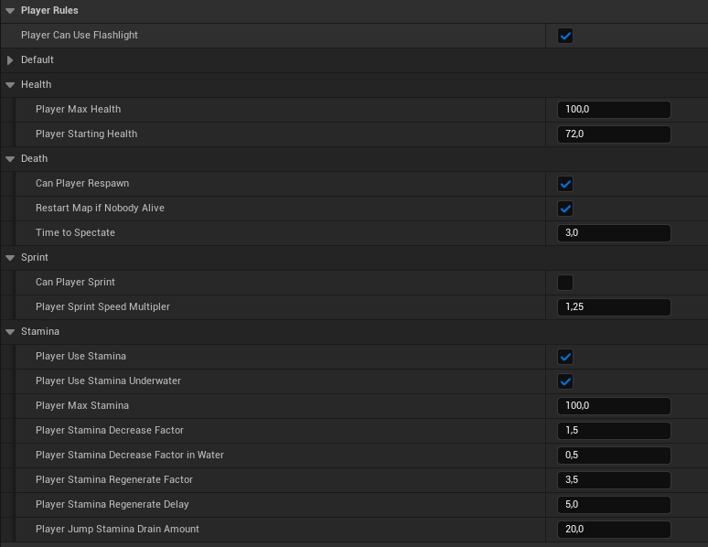
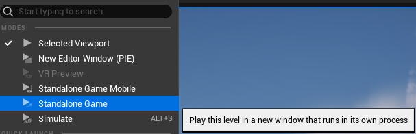
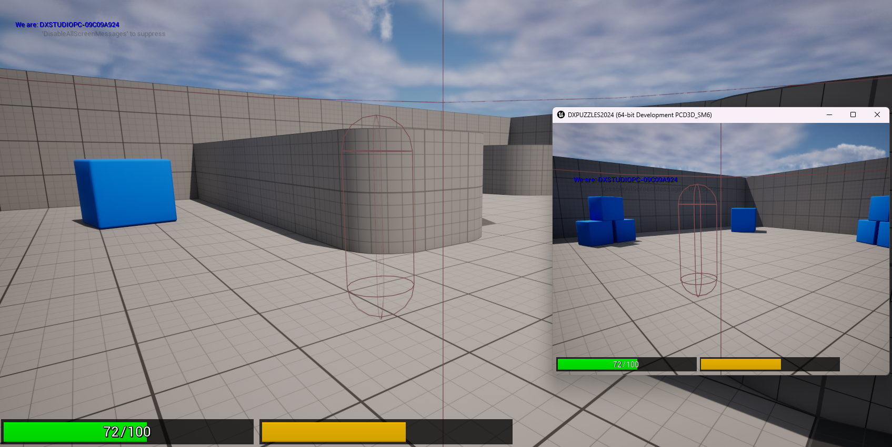
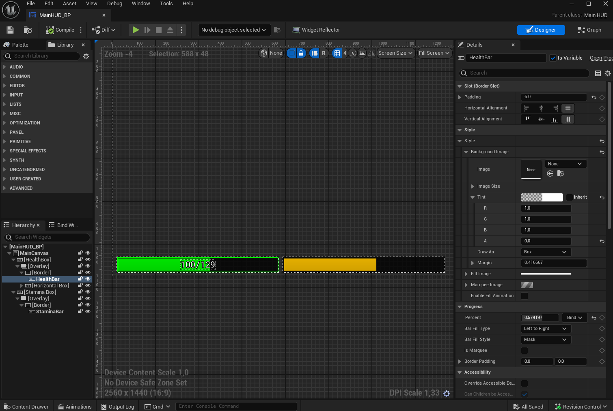
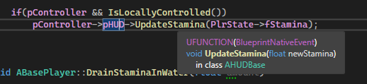

After writing the previous post, I finally managed to sit down and get some coding done on the project using Unreal Engine 5.4. As I mentioned earlier, I want to start from scratch and rewrite everything because the previous project was a huge mess with files and code, and I’ll also take this opportunity to upgrade the project from 5.3 to 5.4.

Initially, I installed all the necessary plugins I’ll be using and ensured they work with the latest Unreal Engine API. HammUEr required some fixes, but it eventually compiled. Once I confirmed the project is compiling, I could start working.

First, I created the classes for all the basic components, namely:

* Gamemode
* GameState
* PlayerState
* BasePlayer
* BasePlayerController
* BasePlayerHUD

I'm currently missing things like GameSession, Spectator etc. but I don't need them at the moment - I'm not sure if I want to manage Steam sessions from C++.

If I were making a single-player game, it wouldn’t matter where and what code I placed, but for a multiplayer game, the code should be placed in appropriate locations. The order of initialization of various objects and whether they exist on the client, the server, or both is also crucial.

**Gamemode** - As the name suggests, it should handle all the game rules. Here, you will find functions for restarting the game, respawning the player, etc. It exists only on the server, so it’s a safe place for managing such things. It inherits from the ``AGamemode`` class.

**GameState** -  As the name suggests, it stores our current game state and all necessary information. For example, the number of alive players, whether the round is ongoing, if the match has ended, who the points leader is, etc. All information here will be synchronized between server and clients. It inherits from the ``AGameState`` class.

<div class="alert alert-light"" role="alert">

I want most things on each map in my game to be configurable, such as how much health a player starts with, the maximum health they can have, whether they can sprint, if sprinting uses stamina, if they can use a flashlight, and many other rules. I created these rules in the gamemode class so that a derived gamemode with new rules for another map can be made. Then I am copying these set rules to the GameState object to ensure that every player has synchronized settings and to avoid complications of fetching values from Gamemode, which exists only on the server.

<br><br>

<center>




</center>
</div>

**PlayerState** - As the name suggests, it stores information about the player, such as whether they are alive, how many points they have, etc. These values are transferred between map loads and do not reset when the player’s object is destroyed. Therefore, storing information like health here is not appropriate. It inherits from the ``APlayerState`` class.

**BasePlayer** - In Unreal, this class should simply be called "Character." I prefer the name I use because it’s more intuitive. This is where we place all such information like health. This class also handles the logic for taking damage, interacting with items, etc. It inherits from the ``ACharacter`` class.

**BasePlayerController** - This is our player’s controller, where we should place for example the logic for assigning key bindings to control the player. It inherits from the ``APlayerController`` class.

**BasePlayerHUD** - Here, we handle the entire player interface, including what should be displayed and when. It inherits from the ``AHUD`` class. Example:

```cpp
void ABasePlayerHUD::UpdateHealthHUD(float newHealth)
{
	UMainHUD* HUD = Cast<UMainHUD>(HUD_Widget);

	if(HUD)
	{
		HUD->UpdateHealth(newHealth);
	}
	else
	{
		GEngine->AddOnScreenDebugMessage(-1, 15, FColor::Red, "Can't get UMainHUD!");
	}
	
}
```
In my previous project, I had issues referring to these objects among themselves. Often, my code referred to GameState before it was initialized. The same issues applied to the player’s HUD. Therefore, I focused on ensuring that the code referred to this class in the correct place and that the HUD object was always available.

I also misused net-code previously. I struggled with understanding how it works in Unreal Engine, but it’s getting better. I realized that functions updating the player interface, like updating health upon spawn, need to be called only on the Owning Client. That's the reason, these functions must be RPCs (Remote Procedure Calls).

I created the ``RestorePlayer()`` function in the player class to restore default values like health and maximum health upon respawn.

```cpp
void ABasePlayer::RestorePlayer()
{
	// Get the values from gamerules/gamestate
	if(GameState)
	{
		UpdateHealth(GameState->StartingHealth);
	}
}
```

``UpdateHealth()`` body:

```cpp
void ABasePlayer::UpdateHealth_Implementation(float newHealth)
{
	const float fClampedHealth = FMath::Clamp(newHealth, 0.0f, GameState->MaxPlayerHealth);
	
	Health = fClampedHealth;
	ClientUpdateHealth(fClampedHealth, GameState->MaxPlayerHealth);
}
```
This is **Server RPC** which means it is calculated by server, it also should have *validate* function to check if value is in min and max bounds to prevent cheating.

The code checks if health value is correct, checks if it is not greater than max health value set in gamerules. Then we set the health variable and execute client RPC ``ClientUpdateHealth`` which looks like this:


```cpp
void ABasePlayer::ClientUpdateHealth_Implementation(float newHealth, bool bUpdateMaxHealth)
{
	ABasePlayerController* PlrController = Cast<ABasePlayerController>(GetController());
	if(PlrController)
	{
		PlrController->GetMainHUD()->UpdateHealthHUD(newHealth, newMaxHealth);
	}
}
```
As you can see, we are looking for player controller which would have link to player HUD. Thanks to RPC we are sure that will be executed only on owning client - the player which are controlling this one particular player object.

{}

In Unreal Engine, it’s important to consider how to test multiplayer games. The best and most reliable way is to run the game using the **Standalone Game** option or uncheck `Run under one process` in the settings. This ensures the game runs as two separate processes. With this option checked, you might notice debug messages appearing on every client even though they are coded to display only on the Owning Client. This is not well-documented and I don't know why such a basic thing is not described anywhere.

<center>



</center>

{}

Here's what I've achieved so far on that clear 5.4 project:



The most important thing is that there are no issues with HUD initialization. Next, I plan to create an object that deals damage to our player, so player will be able to respawn afterward. I also need to create an actor for the spectator... a lot of work awaits me. I somewhat regret starting from scratch, but I know that doing it a second time will turn out better. It always turns out better. Does anyone else feel this way?

Also this is the first time I coded widgets (that's what should it be called by UE) in C++. All I had to do was just make a class derived from ``UUserWidget``, declare "components" like **progress bars, labels**.

```cpp
class DXPUZZLES2024_API UMainHUD : public UUserWidget
{
	GENERATED_BODY()

	
protected:
	virtual void NativeTick(const FGeometry& MyGeometry, float InDeltaTime) override;

	UPROPERTY(meta=(BindWidget))
	TObjectPtr<UCanvasPanel> MainCanvas;

	// Health
	UPROPERTY(meta=(BindWidget))
	TObjectPtr<UHorizontalBox> HealthBox;
	
	UPROPERTY(meta=(BindWidget))
	TObjectPtr<UProgressBar> HealthBar;

	UPROPERTY(meta=(BindWidget))
	TObjectPtr<UTextBlock> HealthLabel;

	UPROPERTY(meta=(BindWidget))
	TObjectPtr<UTextBlock> MaxHealthLabel;

	// Stamina

	UPROPERTY(meta=(BindWidget))
	TObjectPtr<UHorizontalBox> StaminaBox;
	
	UPROPERTY(meta=(BindWidget))
	TObjectPtr<UProgressBar> StaminaBar;```

```
Then I just need to make a another child class of my ``UMainHUD`` but this time in the Unreal Editor. 

<center>



</center>


To bind these widgets like progress bar to that specific one in code you must name it **in the same way as in C++**, so as you can see I have the exact same names in the editor and code.


### The biggest advantage of making HUD in C++

If you have your HUD coded in low-level in C++ you have more control on things you're doing. You don't have to check for variables if they're valid or not. You don't event must do it in the **Tick** function which is very un-performant. In that way my HUD only changes when I call ``UpdateHealth`` or ``UpdateMaxHealth`` function.

Previously I done my HUD code in the blueprints. It was difficult to do when I had for example health variable coded in C++ in BasePlayer class and wanted to update the HUD from player class. It was almost impossible because firstly C++ is initialized, then blueprints when game starts. 



The only way of workaround this was calling **Blueprints Native Events**. I was able to execute code when I was changing the variables for example stamina as on the screen.

### Null pointers and fixes

My code not worked as I excepted but it is much better than previous. What was exactly wrong? I implemented in ``BeginPlay`` function initializaiton of HUD widget. 

I also wasn't creating it by ```CreateWidget``` function so it gave me null pointers on clients.

```cpp
void ABasePlayerHUD::BeginPlay()
{
	Super::BeginPlay();

	InitializeHUDWidget();
}

void ABasePlayerHUD::InitializeHUDWidget()
{
	if(HUD_Widget) // check if assigned any
	{
		if(HUDInstance) // We don't wanna re-init more than one HUD Widget
			return;
		
		HUDInstance = CreateWidget<UMainHUD>(GetWorld(), HUD_Widget);
		if(HUDInstance)
		{
			HUDInstance->AddToViewport();
		}
		else
		{
			GEngine->AddOnScreenDebugMessage(-1,15,FColor::Red, TEXT("Failed to create HUD Instance"));
		}
	}
	else
	{
		UE_LOG(LogTemp, Fatal, TEXT("HUD CLASS NOT ASSIGNED!"));
	}
}
```

I was thinking it will be executed as first then my RPC called ```UpdateHealth``` will be called. I was wrong. The RPC was first. So I got the workaround to check in RPC if HUD is created and initialized - if not, initialize it, then execute the code which updates the values. Works perfect now.

```cpp
void ABasePlayerHUD::UpdateHealthHUD(float newHealth, float newMaxHealth)
{
	if(!HUDInstance)
		InitializeHUDWidget();
	
	if(HUDInstance)
	{
		HUDInstance->UpdateHealth(newHealth, newMaxHealth);
	}
	else
	{
		GEngine->AddOnScreenDebugMessage(-1, 15, FColor::Red, "Can't get UMainHUD!");
	}
}
```

Now it's time to make player death.